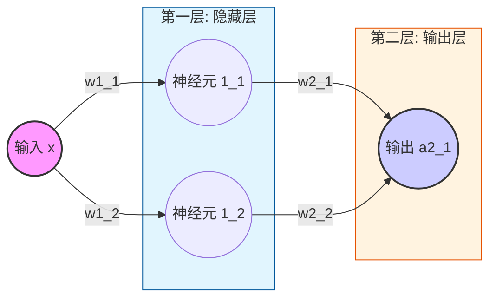

# Dl里程
## 前言
* 后续仅涉及需要前置仅导数知识，再无其他（放心食用），本次不会有对导数的数学推导，仅简单介绍。
* 可根据标题跳过任一已知段落
## 预备知识
> 详细还需自行复习一下，仅简单介绍
### 导数
古人常说 “天圆地方”，并非真的认为天地就是方形与圆形，而是因为站在人的尺度上，我们相对于地球实在太过渺小。
就像一条连续的曲线，在上帝视角里它是弯曲的；可当我们把目光聚焦在极小的一段上时，它就可以被近似看成一条直线。这在数学上，正是极限的思想。
把这一小段 “近似直线” 无限细分，我们就能算出它的倾斜程度 —— 也就是斜率，对应到数学里，就是导数。

### 链式求导法则
链式求导法则 (Chain Rule) 是微积分中用于计算复合函数导数的核心法则。它允许我们将复杂函数的求导过程，拆解为多层简单函数导数的连续乘积，完美体现了“化繁为简”的数学思想。如y = sin(x²)

| 步骤 | 操作 | 结果 |
| --- | --- | --- |
| 1. 识别复合结构 | y = sin(u)，其中 u = x² | 外层函数 f(u) = sin(u)，内层函数 g(x) = x² |
| 2. 求外层导数 | f'(u) = cos(u) | 对 sin(u) 求导得 cos(u)，此时 u 视为整体 |
| 3. 求内层导数 | g'(x) = 2x | 对 x² 求导得 2x |
| 4. 链式相乘 | dy/dx = f'(u) * g'(x) | dy/dx = cos(u) * 2x |
| 5. 回代 | 将 u = x² 代回 | dy/dx = cos(x²) * 2x |

### 1. 数学基石 (验证梯度)
#### 1.1 损失函数
生活里我们总在不自觉地 “评估差距”，就像你网购了一箱水果，想知道商家有没有缺斤短两、口感是否达标等不同的评估场景，用的 “算账方式” 完全不一样。
比如你先拿一个苹果称重：商家标重 200 克，实际只有 180 克，你直接算 “200-180=20 克”，这就是单数据的差值判断，一眼就能看出 “少了 20 克”，简单直接，就像日常比两个数的差距只算差。
可如果要查整箱 10 个苹果的总缺量，就不能只简单加所有差值了 —— 假设其中 8 个少了（差值为正）、2 个多了（差值为负），要是直接把 “+20、+15、-5、-8……” 全加起来，多的会抵消少的，最后算出来 “总缺 12 克”，其实根本没反映出商家普遍缺斤短两的问题。这时候就需要要求差值同正 / 同负再求和：只把所有 “少了的差值” 加起来（20+15+…），算出 “总共少了 43 克”，这才是整箱苹果真实的亏欠总量，就像批量数据里只算同向差距的总和，避免正负抵消掩盖真实问题。
而评估函数结果用的均方误差（MSE），也就是（预期 - 实际）² 再平均，就更有意思了 —— 好比你是甜品师，要评学徒做的蛋糕甜度：预期糖量 10 克，学徒 A 做的差 1 克（9 克），学徒 B 差 5 克（15 克）。如果只算差值，只是 “差 1” 和 “差 5” 的区别；但平方之后，A 的误差是 1²=1，B 的是 5²=25，差距一下子被放大了。
为什么要这么做？就像甜度差 1 克几乎吃不出来，差 5 克要么齁甜要么没味，是 “致命误差” 就是故意让 “大误差” 更显眼，避免小误差和大误差混为一谈。而且平方还能自动消除正负：多放 5 克糖（+5）和少放 5 克糖（-5），对口感的破坏是一样的，平方后都是 25，刚好符合 “误差不分正负，只分大小” 的评估逻辑。这也是为什么评估模型、函数的预测结果时，我们不用简单的差值求和，反而偏爱MSE它能精准抓住那些 “影响关键” 的大误差，让评估结果更贴合实际使用的感受。
> 如果不求平均就是 SSE = Σ (y_hat - y)^2,误差平方和，衡量所有样本预测误差的总和。受样本量影响大，数据集越大，SSE 值通常越大，无法直接用于比较不同规模数据集的模型。对异常值同样敏感,与 MSE 一样，由于平方项，两者都对异常值非常敏感。
> 
#### 1.1 单参数函数拟合
最基础也是最简单的函数y=2x+3+噪声，我们初始化线性模型（就是y=?x+?这个函数），未知的变量设置为w 和 b ,并初始化一个随机数值.现在需要假设我们不知道目标函数的具体值，我们如何让模型去慢慢拟合（让w和b向预期的值慢慢靠近）一个最优函数？
答案就是根据损失函数求极值
```
损失L = (1/n) * Σ(ŷ_i - y_i)²   #（ŷ_i是模型预测值=w*x_i + b，y_i是真实值）
```


损失越小，说明模型预测越准，我们的目标就是找到让L最小的w和b。
可能一瞬间想到最简单的就是直接求导数为0（二次函数最低点专属名称：正规方程（Normal Equation），本质是解方程组 ∂L/∂w=0、∂L/∂b=0）
```
对损失函数 L = (1/n)Σ(w·x_i + b - y_i)² 分别求 w、b 的偏导并令其为 0，可推导出：
# w推导示例
1. 引入中间变量
z_i = w * x_i + b - y_i
L =  (1/n)Σ z_i²
2. 应用链式法则
∂z_i²/∂z_i = 2z_i
∂z_i/∂w = x_i
3. 组合求和
∂L/∂w =  (2/n)Σ ((w * x_i + b - y_i) * x_i)

∂L/∂b = (2/n)Σ (w * x_i + b - y_i)

正规方程则是求
(2/n)Σ  ( (w * x_i + b - y_i)* x_i) = 0
(2/n)Σ (w * x_i + b - y_i) = 0
此时计算量变为 O(k³)（k 为参数数）
```
\mse_loss_plot.png)
模型简单时确实是个很好的很快的办法，但是当模型复杂时计算量会随着复杂度指数增加k=10000 时，计算量≈10¹²（普通电脑算几年都算不完）,而且复杂模型（如神经网络、带非线性激活的模型）的损失函数是非凸函数（有无数个局部最低点），即使能求导，也无法通过 “导数 = 0” 找到全局最优解。
所以更通用的方式是`梯度下降`，可以观察一下导数内的gif图中的二次函数的导数变化
把损失函数想象成一座“山坡”，梯度（简单理解就是斜率）就是当前位置的“坡度方向”，沿着梯度反方向走，就能一步步走到山坡最低点（损失最小）。
对w和b分别求偏导（梯度）：
```
y_hat = w*x_i + b
∂L/∂w = (2/n) * Σ( (y_hat - y_i) * x_i )  （w的调整方向）
∂L/∂b = (2/n) * Σ( y_hat - y_i )        （b的调整方向）
```
每次迭代都根据梯度调整w和b
```
w = w - ∂L/∂w
b = b - ∂L/∂b
```
\mse_loss_curve_fixed_b_nl.gif)
> 可见反复振荡导致越来越偏离最优解，很明显是由于步子迈的太大。这是就应该引入`学习率`来让步子小一点
##### 学习率
1. 梯度本身没有“尺度”概念：梯度的大小取决于损失函数的形状和当前参数位置。一个很大的梯度值并不意味着“应该走很远”，一个很小的梯度也不意味着“应该原地不动”。学习率提供了必要的缩放因子，将梯度转化为合理的参数更新量。
2. 实现可控的优化过程：没有学习率，优化算法就失去了对更新步长的控制，无法在快速前进和精细调整之间做出权衡。
3. 适应不同问题：不同模型、不同数据集、不同损失函数对步长的敏感度不同。学习率作为一个可调超参数(自己手动设置固定参数就叫超参数)，允许我们为特定任务定制优化过程。
```
grad_w, grad_b = calculate_gradient(w, b, x, y_noise)
# 计算步长
a = 0.1 # 学习率
w = w - a * grad_w  
b = b - a * grad_b
```
\mse_loss_curve_fixed_b.gif)

\instance.gif)
#### 1.2 多参数函数模拟
> 后面会偏向使用代码示例而非数学公式

用来模拟的场景为生成非线性房价数据：面积120㎡最优、楼层越低越贵。多参数单参数其实一模一样仅多一个偏导数的下降。
构建测试数据
```
def generate_multi_param_data(n_samples=300, noise_std=3.0):
    """生成非线性房价数据：面积120㎡最优、楼层越低越贵"""
    np.random.seed(42)
    
    # 特征范围：面积80~160㎡，楼层1~30层
    x1 = np.random.uniform(80, 160, n_samples)   # 面积（㎡） np.random.uniform是生成指定范围内的均匀分布随机浮点数 第一个是下限第二个是上限
    x2 = np.random.randint(1, 31, n_samples)     # 楼层（层） np.random.randint是生成指定范围内的离散均匀分布随机整数。第一个是下限第二个是上限
    X = np.column_stack((x1, x2))               # np.column_stack 按列堆叠一维数组
    
    # 非线性房价公式（核心：保留原始二次项）
    area_term = -0.05 * (x1 - 120) ** 2  # 120㎡最优（二次项）
    floor_term = -2 * x2                 # 楼层越低越贵（负系数）
    noise = np.random.normal(0, noise_std, n_samples)
    y = area_term + floor_term + 200 + noise
    y = np.clip(y, a_min=50, a_max=None)
    
    return X, y
# 等价函数
def generate_multi_param_data(n_samples=300, noise_std=3.0):
    """生成非线性房价数据：面积120㎡最优、楼层越低越贵"""
    random.seed(42)
    
    # 特征范围：面积80~160㎡，楼层1~30层
    x1 = [random.uniform(80, 160) for _ in range(n_samples)]  # 面积（㎡）
    x2 = [random.randint(1, 30) for _ in range(n_samples)]    # 楼层（层）
    
    # 非线性房价公式
    y = []
    for area, floor in zip(x1, x2):
        area_term = -0.05 * (area - 120) ** 2  # 120㎡最优
        floor_term = -2 * floor                # 楼层越低越贵
        noise = random.gauss(0, noise_std)
        price = area_term + floor_term + 200 + noise
        y.append(max(50, price))  # 最低价50万
    
    return list(zip(x1, x2)), y
```
##### 梯度下降
```
# 前向计算（原始二次项，保证非线性）
y_pred = w1 * x1_quad + w2 * x2 + b

# 数值稳定的损失计算
loss = np.mean(np.clip((y_pred - y) ** 2, 0, 1e5))
loss_list.append(loss)

# 梯度计算 + 裁剪（防止爆炸）
grad_w1 = 2 * np.mean(np.clip((y_pred - y) * x1_quad, -1e3, 1e3))
grad_w2 = 2 * np.mean(np.clip((y_pred - y) * x2, -1e3, 1e3))
grad_b = 2 * np.mean(np.clip(y_pred - y, -1e3, 1e3))

# 参数更新（小步长+约束）
w1 = np.clip(w1 - lr * grad_w1, -0.1, 0)    # 约束在合理范围
w2 = np.clip(w2 - lr * grad_w2, -3, 0)      # 约束在合理范围
b = np.clip(b - lr * grad_b, 180, 220)      # 约束在合理范围
```
同等的原生实现
```
# 数值稳定的损失计算
squared_error = [(pred - true) ** 2 for pred, true in zip(y_pred, y)]
clipped_error = [min(err, 1e5) for err in squared_error]
loss = sum(clipped_error) / len(clipped_error)
loss_list.append(loss)

# 梯度计算 + 裁剪（防止爆炸）
# 计算误差项
error = [pred - true for pred, true in zip(y_pred, y)]
clipped_error = [max(min(e, 1e3), -1e3) for e in error]

# 计算梯度
grad_w1 = 2 * sum(e * x1 for e, x1 in zip(clipped_error, x1_quad)) / len(clipped_error)
grad_w2 = 2 * sum(e * x2 for e, x2 in zip(clipped_error, x2)) / len(clipped_error)
grad_b = 2 * sum(clipped_error) / len(clipped_error)

# 参数更新（小步长+约束）
w1 = max(min(w1 - lr * grad_w1, 0), -0.1)    # 约束在[-0.1, 0]
w2 = max(min(w2 - lr * grad_w2, 0), -3)      # 约束在[-3, 0]
b = max(min(b - lr * grad_b, 220), 180)      # 约束在[180, 220]
```
\instance.gif)
### 2.1 神经网络FCN
在构建预测模型时，我们最初的直觉往往来自数据本身呈现的直观形态。例如，当数据点大致沿一条直线分布时，我们会想到用线性模型（y = wx + b）来拟合；如果数据呈现抛物线趋势，则会考虑二次曲线。这类模型形式简单，规律一目了然。

然而，现实世界中的复杂数据，其内在规律远非简单的直线或曲线所能刻画。数据之间的关系可能是高度非线性、错综复杂的。这时，一个很自然的思路是使用更强大的函数，比如高次多项式。理论上，通过增加多项式的次数，我们可以拟合出非常曲折的曲线，逼近几乎任何复杂模式。

但这条路存在几个明显的局限性：

过拟合风险：高阶多项式对训练数据中的噪声极为敏感，容易“死记硬背”数据，导致在新数据上表现很差。
计算与解释性：随着次数升高，模型参数急剧增加，计算复杂度上升，且模型变得难以理解和解释。
灵活性瓶颈：即便如此，单一的多项式函数在表达某些复杂模式（如分层、分段的规则）时依然能力有限。
那么，如何构建一个既强大又灵活的非线性模型呢？神经网络 的核心思想提供了一个优雅的解决方案。

我们可以从最简单的单元——线性变换（y = wx + b）——开始。它的优点是计算高效、含义清晰。但正如你所知，无论将多少个这样的线性单元直接叠加，其整体效果仍然是一个线性变换，无法突破线性的局限。

关键突破在于“激活函数”的引入。 
##### 激活函数

激活函数是一个非线性函数（如 Sigmoid, ReLU）。我们在每个线性变换之后，立即应用一个激活函数。这个操作从根本上改变了游戏规则：

引入非线性：激活函数打破了纯线性组合的约束，使得每个神经元具备了表达非线性关系的能力。
构造复杂函数：通过将许多这样的“线性变换 + 非线性激活”单元层层堆叠，神经网络就像用乐高积木一样，可以组合构造出极其复杂、高度非线性的函数，用以建模真实世界中纷繁复杂的数据关系。
因此，神经网络并非完全抛弃了简单的线性模型，而是以它为基石，通过巧妙地引入并堆叠“非线性激活”层，最终获得了逼近任意复杂函数的强大能力。这解决了单纯使用高次多项式所面临的诸多困境，成为处理现代复杂预测任务的利器。
\activation_functions_visualization.gif)
\activation_functions_comparison.png)
##### 使用神经元拟合
1. 模拟炼丹时丹药大小和药效的关系
> 定义条件：0.4 到 1.2 之间有效(1)，否则无效(0)
> 目标：让神经网络自动学会这个“中间有效、两头无效”的规律。

* 设计模型
> 为什么是“1-2-1”结构？ 如果时是刚接触可能很多人会疑问， 层数和每层节点都是如何知道的？ 
> 我们可以把神经网络想象成“形状拼图”：
> 单个 Sigmoid 的局限：
一个神经元（Sigmoid）只能画出一条“S型”曲线。它要么是从 0 变到 1（上升沿），要么是从 1 变到 0（下降沿）。它像一把切菜刀，只能切一刀，分出“左边”和“右边”。
> “两把刀”拼出“几”字形：
> 我们要的药效曲线是一个“凸”起（几字形）：
> 第 1 把刀（神经元 1_1）：负责切出 0.4 处的上升沿（从小变大，药效开始起作用）。
> 第 2 把刀（神经元 1_2）：负责切出 1.2 处的下降沿（从大变更大，药效消失）。
>第二层的整合（输出层）：
> 最后一层那个节点（1 个节点）的作用就像“胶水”。它负责把第一层的两道曲线“叠加”在一起。
> 公式：最终输出 = 曲线A + 曲线B + 偏移量
> 通过调整权重，它能让两道弧线重叠，形成我们想要的那个中间凸起的形状。
> 层数和节点是怎么定的？
> 看形状（直觉法）：
> 对于简单的任务，你可以观察数据的分布。如果图像弯曲了一次，可能需要 1 个隐藏节点；如果像我们这次一样是一个“包围圈”，至少需要 2 个节点来围住这个区间。
> 看经验（工程法）：
> 现实中的数据往往是几万维的，肉眼看不出形状。这时候我们通常先给一个“经验值”（比如 32、64 个节点），如果拟合得不好（欠拟合），就多加点节点或层数；如果学过头了（过拟合），就减一点。这也就是俗称的“调参”。

数学定义
```
z1_1 = w1_1 * xs + b1_1
a1_1 = sigmoid(z1_1)

z1_2 = w1_2 * xs + b1_2
a1_2 = sigmoid(z1_2)

z2_1 = w2_1 * a1_1 + w2_2 * a1_2 + b2_1
a2_1 = sigmoid(z2_1)
e = (y-a1_2)^2
```
先采用批量梯度下降（Batch Gradient Descent），拟合的更稳定，但速度较慢。
```python
def train():
    # 第一层参数
    w1_1, b1_1 = random.uniform(-1, 1), random.uniform(-1, 1)
    w1_2, b1_2 = random.uniform(-1, 1), random.uniform(-1, 1)
    # 第二层参数
    w2_1, w2_2, b2_1 = random.uniform(-1, 1), random.uniform(-1, 1), random.uniform(-1, 1)

    alpha = 0.8  # 学习率
    epochs = 20000
    for epoch in range(epochs):
        current_preds = []
        """
        z1_1 = w1_1 * xs + b1_1
        a1_1 = sigmoid(z1_1)

        z1_2 = w1_2 * xs + b1_2
        a1_2 = sigmoid(z1_2)

        z2_1 = w2_1 * a1_1 + w2_2 * a1_2 + b2_1
        a2_1 = sigmoid(z2_1)
        e = (y-a1_2)^2
    """
        # 模拟批量梯度下降中的累加梯度
        dw1_1, db1_1 = 0, 0
        dw1_2, db1_2 = 0, 0
        dw2_1, dw2_2, db2_1 = 0, 0, 0
        loss = 0
        for i in range(m):
            x = xs[i]
            y = ys[i]

            # --- 前向传播 ---
            z1_1 = w1_1 * x + b1_1
            a1_1 = sigmoid(z1_1)
            z1_2 = w1_2 * x + b1_2
            a1_2 = sigmoid(z1_2)

            z2_1 = w2_1 * a1_1 + w2_2 * a1_2 + b2_1
            a2_1 = sigmoid(z2_1)
            
            current_preds.append(a2_1)
            loss += (a2_1 - y) ** 2 
            # --- 反向传播 (链式法则手动求导) ---
            # 损失函数 L = (a2_1 - y)^2
            deda2 = 2 * (a2_1 - y)
            da2dz2 = a2_1 * (1 - a2_1)
            
            # 第二层梯度
            dw2_1 += deda2 * da2dz2 * a1_1
            dw2_2 += deda2 * da2dz2 * a1_2
            db2_1 += deda2 * da2dz2 * 1
            
            # 第一层梯度 (经过神经元 1_1)
            # 梯度传递：L -> a2 -> z2 -> a1_1 -> z1_1 -> w1_1/b1_1
            dL_da1_1 = deda2 * da2dz2 * w2_1  # ∂L/∂a1_1
            da1_1_dz1_1 = a1_1 * (1 - a1_1)   # ∂a1_1/∂z1_1
            dz1_1_dw1_1 = x                   # ∂z1_1/∂w1_1
            dz1_1_db1_1 = 1                   # ∂z1_1/∂b1_1

            dw1_1 += dL_da1_1 * da1_1_dz1_1 * dz1_1_dw1_1
            db1_1 += dL_da1_1 * da1_1_dz1_1 * dz1_1_db1_1

            # 第一层梯度 (神经元 1_2)
            dL_da1_2 = deda2 * da2dz2 * w2_2  # ∂L/∂a1_2
            da1_2_dz1_2 = a1_2 * (1 - a1_2)   # ∂a1_2/∂z1_2
            dz1_2_dw1_2 = x                   # ∂z1_2/∂w1_2
            dz1_2_db1_2 = 1                   # ∂z1_2/∂b1_2

            dw1_2 += dL_da1_2 * da1_2_dz1_2 * dz1_2_dw1_2
            db1_2 += dL_da1_2 * da1_2_dz1_2 * dz1_2_db1_2
            
            
        loss = loss/m
        # 更新参数 (取平均梯度)
        w1_1 -= alpha * dw1_1 / m
        b1_1 -= alpha * db1_1 / m
        w1_2 -= alpha * dw1_2 / m
        b1_2 -= alpha * db1_2 / m
        w2_1 -= alpha * dw2_1 / m
        w2_2 -= alpha * dw2_2 / m
        b2_1 -= alpha * db2_1 / m

        # 每 20 代记录一次预测线
        if epoch % 20 == 0:
            # print(f"loss:{loss}") 
            history_preds.append(current_preds)
```

在尝试随机梯度下降SGD,会发现随机梯度相加的速度会更快但是会更抖动。

梯度下降就像你在深山里，要摸黑下山回到谷底的村庄。
* 批量梯度下降 (Batch Gradient Descent)
他每走一步之前，都要蹲下来把整座山上所有的石子、坑洼全部摸一遍，计算出一个“绝对精确”的平均坡度，然后才肯迈出一小步。优点是走得极其稳健。只要地形（损失函数）是平滑的凸函数，他一定能走到最深的山谷，绝不绕路。缺点也很明显，太慢了！ 如果山上有 100 万颗石子（100 万条数据），他每走一步都要摸 100 万次。在数据量巨大的今天，这种人往往还没走到山脚，天就亮了（计算资源耗尽）。
* 随机梯度下降 (Stochastic Gradient Descent, SGD)
这种就像是低头只看当前脚下的坡度，就立刻往那个方向蹦一步。优点是极快！ 别人还在摸第一遍坡度时，他可能已经蹦到半山腰了。而且因为他乱蹦，有时反而能跳出一些小的“小土坑”（局部最优解），蹦到更深的山谷去。缺点就是走位极其风骚（不稳定）。 他的路线是锯齿形的，甚至会往山上跳。即便到了谷底，他也不会停下，而是在村口疯狂转圈，很难真正定死在最深点。适合在线学习，或者数据量大到离谱，求快不求精的时候。
* 小批量随机梯度下降 (Mini-Batch SGD)
这是目前 AI 领域（深度学习）最主流的方法。他折中了前两位的方法：每次随手查看周围部分坡度（比如面前90度），算出平均坡度，然后迈一步。优点（真香定律）
又快又稳，而且硬件友好，现代电脑的显卡（GPU）最擅长“一次性处理一小堆数据”。处理 1个坡度和处理 128个坡度时间几乎一样，那为什么不处理 128 个呢？
缺点：你需要额外操心一个参数——Batch Size。抓多了变BGD，抓少了SGD。几乎适用于所有的深度学习场景（CNN、GPT、炼丹必备）。


### 2.2 3D地形拟合
本次拟合为 z = x**2 - y**2
本次采用激活函数为Relu
```
def relu(z):
    return np.maximum(0, z)

def relu_deriv(z):
    return (z > 0).astype(float)

def mse(y_pred, y_true):
    return np.mean((y_pred - y_true)**2)
```
统一定义模型方式（为了后面工程化）
> 其中W1 b1 等数据均不需要考虑矩阵运算就当数组理解即可。
> 比如 W1(self.W1 = np.random.randn(hidden_size, 2) * 0.1)就是64（隐藏层的节点个数） * 2的数组（因为三维拟合两个输入）
> self.Z1 = self.W1 @ X + self.b1 就是数组的遍历乘积求和再放进数组。
```python
Z1 = []
# 对每个隐藏层神经元 i
for i in range(hidden_size):
# 计算加权和：w_i1 * x1 + w_i2 * x2
weighted_sum = W1[i][0] * X[0] + W1[i][1] * X[1]
# 加上偏置
z_i = weighted_sum + b1[i]
Z1.append(z_i)
return Z1
```
```python
class SimpleFCN:
    def __init__(self, hidden_size=64):
        self.W1 = np.random.randn(hidden_size, 2) * 0.1
        self.b1 = np.zeros((hidden_size, 1))
        self.W2 = np.random.randn(1, hidden_size) * 0.1
        self.b2 = np.zeros((1, 1))
        self.loss_history = []

    def forward(self, X):
        self.Z1 = self.W1 @ X + self.b1
        self.A1 = relu(self.Z1)
        self.Z2 = self.W2 @ self.A1 + self.b2
        self.A2 = self.Z2  # 无sigmoid，保留地形起伏
        return self.A2

    def backward(self, X, y_true, lr=0.01):
        m = X.shape[1]
        y_pred = self.A2

        dZ2 = (y_pred - y_true) / m
        dW2 = dZ2 @ self.A1.T
        db2 = np.sum(dZ2, axis=1, keepdims=True)

        dA1 = self.W2.T @ dZ2
        dZ1 = dA1 * relu_deriv(self.Z1)
        dW1 = dZ1 @ X.T
        db1 = np.sum(dZ1, axis=1, keepdims=True)

        self.W1 -= lr * dW1
        self.b1 -= lr * db1
        self.W2 -= lr * dW2
        self.b2 -= lr * db2

    def train_step(self, X, y, lr=0.01):
        y_pred = self.forward(X)
        loss = mse(y_pred, y)
        self.backward(X, y, lr)
        self.loss_history.append(loss)
        return loss
```

\fcn_3d_terrain_visualizer.gif)