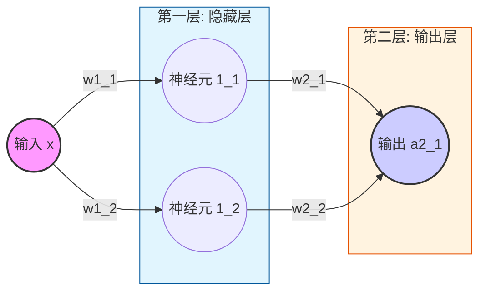

# Dl里程
## 前言
* 后续仅涉及需要前置仅导数知识，再无其他（放心食用），不会有对导数的数学推导，仅简单介绍。
* 可根据标题跳过任一已知段落
### 预备知识
> 详细还需自行复习一下，仅简单介绍
### 导数
古人常说 “天圆地方”，并非真的认为天地就是方形与圆形，而是因为站在人的尺度上，我们相对于地球实在太过渺小。
就像一条连续的曲线，在上帝视角里它是弯曲的；可当我们把目光聚焦在极小的一段上时，它就可以被近似看成一条直线。这种‘局部看是直线’的思想，正是微积分中以直代曲的核心，也就是导数的几何意义。这在数学上，正是极限的思想。
把这一小段 “近似直线” 无限细分，我们就能算出它的倾斜程度 —— 也就是斜率，对应到数学里，就是导数。

### 链式求导法则
链式求导法则 (Chain Rule) 是微积分中用于计算复合函数导数的核心法则。它允许我们将复杂函数的求导过程，拆解为多层简单函数导数的连续乘积，完美体现了“化繁为简”的数学思想。如y = sin(x²)

| 步骤 | 操作 | 结果 |
| --- | --- | --- |
| 1. 识别复合结构 | y = sin(u)，其中 u = x² | 外层函数 f(u) = sin(u)，内层函数 g(x) = x² |
| 2. 求外层导数 | f'(u) = cos(u) | 对 sin(u) 求导得 cos(u)，此时 u 视为整体 |
| 3. 求内层导数 | g'(x) = 2x | 对 x² 求导得 2x |
| 4. 链式相乘 | dy/dx = f'(u) * g'(x) | dy/dx = cos(u) * 2x |
| 5. 回代 | 将 u = x² 代回 | dy/dx = cos(x²) * 2x |

### 1. 数学基石 (验证梯度)
#### pre 损失函数
生活里我们总在不自觉地 “评估差距”，就像你网购了一箱水果，想知道商家有没有缺斤短两、口感是否达标等不同的评估场景，用的 “算账方式” 完全不一样。
比如你先拿一个苹果称重：商家标重 200 克，实际只有 180 克，你直接算 “200-180=20 克”，这就是单数据的差值判断，一眼就能看出 “少了 20 克”，简单直接，就像日常比两个数的差距只算差。
可如果要查整箱 10 个苹果的总缺量，就不能只简单加所有差值了 —— 假设其中 8 个少了（差值为正）、2 个多了（差值为负），要是直接把 “+20、+15、-5、-8……” 全加起来，多的会抵消少的，最后算出来 “总缺 12 克”，其实根本没反映出商家普遍缺斤短两的问题。这时候就需要要求差值同正 / 同负再求和：只把所有 “少了的差值” 加起来（20+15+…），算出 “总共少了 43 克”，这才是整箱苹果真实的亏欠总量，就像批量数据里只算同向差距的总和，避免正负抵消掩盖真实问题。
而评估函数结果用的均方误差（MSE），也就是（预期 - 实际）² 再平均，就更有意思了 —— 好比你是甜品师，要评学徒做的蛋糕甜度：预期糖量 10 克，学徒 A 做的差 1 克（9 克），学徒 B 差 5 克（15 克）。如果只算差值，只是 “差 1” 和 “差 5” 的区别；但平方之后，A 的误差是 1²=1，B 的是 5²=25，差距一下子被放大了。
为什么要这么做？就像甜度差 1 克几乎吃不出来，差 5 克要么齁甜要么没味，是 “致命误差” 就是故意让 “大误差” 更显眼，避免小误差和大误差混为一谈。而且平方还能自动消除正负：多放 5 克糖（+5）和少放 5 克糖（-5），对口感的破坏是一样的，平方后都是 25，刚好符合 “误差不分正负，只分大小” 的评估逻辑。这也是为什么评估模型、函数的预测结果时，我们不用简单的差值求和，反而偏爱MSE它能精准抓住那些 “影响关键” 的大误差，让评估结果更贴合实际使用的感受。
> 如果不求平均就是 SSE = Σ (y_hat - y)^2,误差平方和，衡量所有样本预测误差的总和。受样本量影响大，数据集越大，SSE 值通常越大，无法直接用于比较不同规模数据集的模型。对异常值同样敏感,与 MSE 一样，由于平方项，两者都对异常值非常敏感。
> 
#### 1.1 单参数函数拟合
最基础也是最简单的函数y=2x+3+噪声，我们初始化线性模型（就是y=?x+?这个函数），未知的变量设置为w 和 b ,并初始化一个随机数值.现在需要假设我们不知道目标函数的具体值，我们如何让模型去慢慢拟合（让w和b向预期的值慢慢靠近）一个最优函数？
答案就是根据损失函数求极值
```
损失L = (1/n) * Σ(ŷ_i - y_i)²   #（ŷ_i是模型预测值=w*x_i + b，y_i是真实值）
```


损失越小，说明模型预测越准，我们的目标就是找到让L最小的w和b。
可能一瞬间想到最简单的就是直接求导数为0（二次函数最低点专属名称：正规方程（Normal Equation），本质是解方程组 ∂L/∂w=0、∂L/∂b=0）
```
对损失函数 L = (1/n)Σ(w·x_i + b - y_i)² 分别求 w、b 的偏导并令其为 0，可推导出：
# w推导示例
1. 引入中间变量
z_i = w * x_i + b - y_i
L =  (1/n)Σ z_i²
2. 应用链式法则
∂z_i²/∂z_i = 2z_i
∂z_i/∂w = x_i
3. 组合求和
∂L/∂w =  (2/n)Σ ((w * x_i + b - y_i) * x_i)

∂L/∂b = (2/n)Σ (w * x_i + b - y_i)

正规方程则是求
(2/n)Σ  ( (w * x_i + b - y_i)* x_i) = 0
(2/n)Σ (w * x_i + b - y_i) = 0
此时计算量变为 O(k³)（k 是特征维度）
```
\mse_loss_plot.png)
模型简单时确实是个很好的很快的办法，但是当模型复杂时计算量会随着复杂度指数增加k=10000 时，计算量≈10¹²（计算成本极高，且难以并行化，不适合大规模特征）,而且复杂模型（如神经网络、带非线性激活的模型）的损失函数是非凸函数（有无数个局部最低点），即使能求导，也无法通过 “导数 = 0” 找到全局最优解。
所以更通用的方式是`梯度下降`，可以观察一下导数内的gif图中的二次函数的导数变化
把损失函数想象成一座“山坡”，梯度（简单理解就是斜率）就是当前位置的“坡度方向”，沿着梯度反方向走，就能一步步走到山坡最低点（损失最小）。
对w和b分别求偏导（梯度）：
```
y_hat = w*x_i + b
∂L/∂w = (2/n) * Σ( (y_hat - y_i) * x_i )  （w的调整方向）
∂L/∂b = (2/n) * Σ( y_hat - y_i )        （b的调整方向）
```
每次迭代都根据梯度调整w和b
```
w = w - ∂L/∂w
b = b - ∂L/∂b
```
\mse_loss_curve_fixed_b_nl.gif)
> 可见反复振荡导致越来越偏离最优解，很明显是由于步子迈的太大。这是就应该引入`学习率`来让步子小一点
##### 学习率
1. 梯度本身没有“尺度”概念：梯度的大小取决于损失函数的形状和当前参数位置。一个很大的梯度值并不意味着“应该走很远”，一个很小的梯度也不意味着“应该原地不动”。学习率提供了必要的缩放因子，将梯度转化为合理的参数更新量。
2. 实现可控的优化过程：没有学习率，优化算法就失去了对更新步长的控制，无法在快速前进和精细调整之间做出权衡。
3. 适应不同问题：不同模型、不同数据集、不同损失函数对步长的敏感度不同。学习率作为一个可调超参数(自己手动设置固定参数就叫超参数)，允许我们为特定任务定制优化过程。
```
grad_w, grad_b = calculate_gradient(w, b, x, y_noise)
# 计算步长
a = 0.1 # 学习率
w = w - a * grad_w  
b = b - a * grad_b
```
\mse_loss_curve_fixed_b.gif)

\instance.gif)
#### 1.2 多参数函数模拟
> 后面会偏向使用代码示例而非数学公式

用来模拟的场景为生成非线性房价数据：面积120㎡最优、楼层越低越贵。多参数单参数其实一模一样仅多一个偏导数的下降。
构建测试数据
```
def generate_multi_param_data(n_samples=300, noise_std=3.0):
    """生成非线性房价数据：面积120㎡最优、楼层越低越贵"""
    np.random.seed(42)
    
    # 特征范围：面积80~160㎡，楼层1~30层
    x1 = np.random.uniform(80, 160, n_samples)   # 面积（㎡） np.random.uniform是生成指定范围内的均匀分布随机浮点数 第一个是下限第二个是上限
    x2 = np.random.randint(1, 31, n_samples)     # 楼层（层） np.random.randint是生成指定范围内的离散均匀分布随机整数。第一个是下限第二个是上限
    X = np.column_stack((x1, x2))               # np.column_stack 按列堆叠一维数组
    
    # 非线性房价公式（核心：保留原始二次项）
    area_term = -0.05 * (x1 - 120) ** 2  # 120㎡最优（二次项）
    floor_term = -2 * x2                 # 楼层越低越贵（负系数）
    noise = np.random.normal(0, noise_std, n_samples)
    y = area_term + floor_term + 200 + noise
    y = np.clip(y, a_min=50, a_max=None)
    
    return X, y
# 等价函数
def generate_multi_param_data(n_samples=300, noise_std=3.0):
    """生成非线性房价数据：面积120㎡最优、楼层越低越贵"""
    random.seed(42)
    
    # 特征范围：面积80~160㎡，楼层1~30层
    x1 = [random.uniform(80, 160) for _ in range(n_samples)]  # 面积（㎡）
    x2 = [random.randint(1, 30) for _ in range(n_samples)]    # 楼层（层）
    
    # 非线性房价公式
    y = []
    for area, floor in zip(x1, x2):
        area_term = -0.05 * (area - 120) ** 2  # 120㎡最优
        floor_term = -2 * floor                # 楼层越低越贵
        noise = random.gauss(0, noise_std)
        price = area_term + floor_term + 200 + noise
        y.append(max(50, price))  # 最低价50万
    
    return list(zip(x1, x2)), y
```
##### 梯度下降
```
# 前向计算（原始二次项，保证非线性）
y_pred = w1 * x1_quad + w2 * x2 + b

# 数值稳定的损失计算
loss = np.mean(np.clip((y_pred - y) ** 2, 0, 1e5))
loss_list.append(loss)

# 梯度计算 + 裁剪（防止爆炸）
grad_w1 = 2 * np.mean(np.clip((y_pred - y) * x1_quad, -1e3, 1e3))
grad_w2 = 2 * np.mean(np.clip((y_pred - y) * x2, -1e3, 1e3))
grad_b = 2 * np.mean(np.clip(y_pred - y, -1e3, 1e3))

# 参数更新（小步长+约束）
w1 = np.clip(w1 - lr * grad_w1, -0.1, 0)    # 约束在合理范围
w2 = np.clip(w2 - lr * grad_w2, -3, 0)      # 约束在合理范围
b = np.clip(b - lr * grad_b, 180, 220)      # 约束在合理范围
```
同等的原生实现
```
# 数值稳定的损失计算
squared_error = [(pred - true) ** 2 for pred, true in zip(y_pred, y)]
clipped_error = [min(err, 1e5) for err in squared_error]
loss = sum(clipped_error) / len(clipped_error)
loss_list.append(loss)

# 梯度计算 + 裁剪（防止爆炸）
# 计算误差项
error = [pred - true for pred, true in zip(y_pred, y)]
clipped_error = [max(min(e, 1e3), -1e3) for e in error]

# 计算梯度
grad_w1 = 2 * sum(e * x1 for e, x1 in zip(clipped_error, x1_quad)) / len(clipped_error)
grad_w2 = 2 * sum(e * x2 for e, x2 in zip(clipped_error, x2)) / len(clipped_error)
grad_b = 2 * sum(clipped_error) / len(clipped_error)

# 参数更新（小步长+约束）
w1 = max(min(w1 - lr * grad_w1, 0), -0.1)    # 约束在[-0.1, 0]
w2 = max(min(w2 - lr * grad_w2, 0), -3)      # 约束在[-3, 0]
b = max(min(b - lr * grad_b, 220), 180)      # 约束在[180, 220]
```
\instance.gif)
### 2.1 神经网络FCN
在构建预测模型时，我们最初的直觉往往来自数据本身呈现的直观形态。例如，当数据点大致沿一条直线分布时，我们会想到用线性模型（y = wx + b）来拟合；如果数据呈现抛物线趋势，则会考虑二次曲线。这类模型形式简单，规律一目了然。

然而，现实世界中的复杂数据，其内在规律远非简单的直线或曲线所能刻画。数据之间的关系可能是高度非线性、错综复杂的。这时，一个很自然的思路是使用更强大的函数，比如高次多项式。理论上，通过增加多项式的次数，我们可以拟合出非常曲折的曲线，逼近几乎任何复杂模式。

但这条路存在几个明显的局限性：

过拟合风险：高阶多项式对训练数据中的噪声极为敏感，容易“死记硬背”数据，导致在新数据上表现很差。
计算与解释性：随着次数升高，模型参数急剧增加，计算复杂度上升，且模型变得难以理解和解释。
灵活性瓶颈：即便如此，单一的多项式函数在表达某些复杂模式（如分层、分段的规则）时依然能力有限。
那么，如何构建一个既强大又灵活的非线性模型呢？神经网络 的核心思想提供了一个优雅的解决方案。

我们可以从最简单的单元——线性变换（y = wx + b）——开始。它的优点是计算高效、含义清晰。但正如你所知，无论将多少个这样的线性单元直接叠加，其整体效果仍然是一个线性变换，无法突破线性的局限。

关键突破在于“激活函数”的引入。 
##### 激活函数

激活函数是一个非线性函数（如 Sigmoid, ReLU）。我们在每个线性变换之后，立即应用一个激活函数。这个操作从根本上改变了游戏规则：

引入非线性：激活函数打破了纯线性组合的约束，使得每个神经元具备了表达非线性关系的能力。
构造复杂函数：通过将许多这样的“线性变换 + 非线性激活”单元层层堆叠，神经网络就像用乐高积木一样，可以组合构造出极其复杂、高度非线性的函数，用以建模真实世界中纷繁复杂的数据关系。
因此，神经网络并非完全抛弃了简单的线性模型，而是以它为基石，通过巧妙地引入并堆叠“非线性激活”层，最终获得了逼近任意复杂函数的强大能力。这解决了单纯使用高次多项式所面临的诸多困境，成为处理现代复杂预测任务的利器。
\activation_functions_visualization.gif)
\activation_functions_comparison.png)
##### 使用神经元拟合
1. 模拟炼丹时丹药大小和药效的关系
> 定义条件：0.4 到 1.2 之间有效(1)，否则无效(0)
> 目标：让神经网络自动学会这个“中间有效、两头无效”的规律。

* 设计模型
> 为什么是“1-2-1”结构？ 如果是刚接触可能很多人会疑问， 层数和每层节点都是如何知道的？ 
> 我们可以把神经网络想象成“形状拼图”：
> 单个 Sigmoid 的局限：
一个神经元（Sigmoid）只能画出一条“S型”曲线。它要么是从 0 变到 1（上升沿），要么是从 1 变到 0（下降沿）。它像一把切菜刀，只能切一刀，分出“左边”和“右边”。
> “两把刀”拼出“几”字形：
> 我们要的药效曲线是一个“凸”起（几字形）：
> 第 1 把刀（神经元 1_1）：负责切出 0.4 处的上升沿（从小变大，药效开始起作用）。
> 第 2 把刀（神经元 1_2）：负责切出 1.2 处的下降沿（从大变小，药效消失）。
>第二层的整合（输出层）：
> 最后一层那个节点（1 个节点）的作用就像“胶水”。它负责把第一层的两道曲线“叠加”在一起。
> 公式：最终输出 = 曲线A + 曲线B + 偏移量
> 通过调整权重，它能让两道弧线重叠，形成我们想要的那个中间凸起的形状。
> 层数和节点是怎么定的？
> 看形状（直觉法）：
> 对于简单的任务，你可以观察数据的分布。如果图像弯曲了一次，可能需要 1 个隐藏节点；如果像我们这次一样是一个“包围圈”，至少需要 2 个节点来围住这个区间。
> 看经验（工程法）：
> 现实中的数据往往是几万维的，肉眼看不出形状。这时候我们通常先给一个“经验值”（比如 32、64 个节点），如果拟合得不好（欠拟合），就多加点节点或层数；如果学过头了（过拟合），就减一点。这也就是俗称的“调参”。

数学定义
```
z1_1 = w1_1 * xs + b1_1
a1_1 = sigmoid(z1_1)

z1_2 = w1_2 * xs + b1_2
a1_2 = sigmoid(z1_2)

z2_1 = w2_1 * a1_1 + w2_2 * a1_2 + b2_1
a2_1 = sigmoid(z2_1)
e = (y-a2_1)^2
```
先采用批量梯度下降（Batch Gradient Descent），拟合的更稳定，但速度较慢。
```python
def train():
    # 第一层参数
    w1_1, b1_1 = random.uniform(-1, 1), random.uniform(-1, 1)
    w1_2, b1_2 = random.uniform(-1, 1), random.uniform(-1, 1)
    # 第二层参数
    w2_1, w2_2, b2_1 = random.uniform(-1, 1), random.uniform(-1, 1), random.uniform(-1, 1)

    alpha = 0.8  # 学习率
    epochs = 20000
    for epoch in range(epochs):
        current_preds = []
        """
        z1_1 = w1_1 * xs + b1_1
        a1_1 = sigmoid(z1_1)

        z1_2 = w1_2 * xs + b1_2
        a1_2 = sigmoid(z1_2)

        z2_1 = w2_1 * a1_1 + w2_2 * a1_2 + b2_1
        a2_1 = sigmoid(z2_1)
        e = (y-a1_2)^2
    """
        # 模拟批量梯度下降中的累加梯度
        dw1_1, db1_1 = 0, 0
        dw1_2, db1_2 = 0, 0
        dw2_1, dw2_2, db2_1 = 0, 0, 0
        loss = 0
        for i in range(m):
            x = xs[i]
            y = ys[i]

            # --- 前向传播 ---
            z1_1 = w1_1 * x + b1_1
            a1_1 = sigmoid(z1_1)
            z1_2 = w1_2 * x + b1_2
            a1_2 = sigmoid(z1_2)

            z2_1 = w2_1 * a1_1 + w2_2 * a1_2 + b2_1
            a2_1 = sigmoid(z2_1)
            
            current_preds.append(a2_1)
            loss += (a2_1 - y) ** 2 
            # --- 反向传播 (链式法则手动求导) ---
            # 损失函数 L = (a2_1 - y)^2
            deda2 = 2 * (a2_1 - y)
            da2dz2 = a2_1 * (1 - a2_1)
            
            # 第二层梯度
            dw2_1 += deda2 * da2dz2 * a1_1
            dw2_2 += deda2 * da2dz2 * a1_2
            db2_1 += deda2 * da2dz2 * 1
            
            # 第一层梯度 (经过神经元 1_1)
            # 梯度传递：L -> a2 -> z2 -> a1_1 -> z1_1 -> w1_1/b1_1
            dL_da1_1 = deda2 * da2dz2 * w2_1  # ∂L/∂a1_1
            da1_1_dz1_1 = a1_1 * (1 - a1_1)   # ∂a1_1/∂z1_1
            dz1_1_dw1_1 = x                   # ∂z1_1/∂w1_1
            dz1_1_db1_1 = 1                   # ∂z1_1/∂b1_1

            dw1_1 += dL_da1_1 * da1_1_dz1_1 * dz1_1_dw1_1
            db1_1 += dL_da1_1 * da1_1_dz1_1 * dz1_1_db1_1

            # 第一层梯度 (神经元 1_2)
            dL_da1_2 = deda2 * da2dz2 * w2_2  # ∂L/∂a1_2
            da1_2_dz1_2 = a1_2 * (1 - a1_2)   # ∂a1_2/∂z1_2
            dz1_2_dw1_2 = x                   # ∂z1_2/∂w1_2
            dz1_2_db1_2 = 1                   # ∂z1_2/∂b1_2

            dw1_2 += dL_da1_2 * da1_2_dz1_2 * dz1_2_dw1_2
            db1_2 += dL_da1_2 * da1_2_dz1_2 * dz1_2_db1_2
            
            
        loss = loss/m
        # 更新参数 (取平均梯度)
        w1_1 -= alpha * dw1_1 / m
        b1_1 -= alpha * db1_1 / m
        w1_2 -= alpha * dw1_2 / m
        b1_2 -= alpha * db1_2 / m
        w2_1 -= alpha * dw2_1 / m
        w2_2 -= alpha * dw2_2 / m
        b2_1 -= alpha * db2_1 / m

        # 每 20 代记录一次预测线
        if epoch % 20 == 0:
            # print(f"loss:{loss}") 
            history_preds.append(current_preds)
```

在尝试随机梯度下降SGD,会发现随机梯度相加的速度会更快但是会更抖动。

梯度下降就像你在深山里，要摸黑下山回到谷底的村庄。
* 批量梯度下降 (Batch Gradient Descent)
他每走一步之前，都要蹲下来把整座山上所有的石子、坑洼全部摸一遍，计算出一个“绝对精确”的平均坡度，然后才肯迈出一小步。优点是走得极其稳健。只要地形（损失函数）是平滑的凸函数，他一定能走到最深的山谷，绝不绕路。缺点也很明显，太慢了！ 如果山上有 100 万颗石子（100 万条数据），他每走一步都要摸 100 万次。在数据量巨大的今天，这种人往往还没走到山脚，天就亮了（计算资源耗尽）。
* 随机梯度下降 (Stochastic Gradient Descent, SGD)
这种就像是低头只看当前脚下的坡度，就立刻往那个方向蹦一步。优点是极快！ 别人还在摸第一遍坡度时，他可能已经蹦到半山腰了。而且因为他乱蹦，有时反而能跳出一些小的“小土坑”（局部最优解），蹦到更深的山谷去。缺点就是走位极其风骚（不稳定）。 他的路线是锯齿形的，甚至会往山上跳。即便到了谷底，他也不会停下，而是在村口疯狂转圈，很难真正定死在最深点。适合在线学习，或者数据量大到离谱，求快不求精的时候。
* 小批量随机梯度下降 (Mini-Batch SGD 目前主流的所指的SGD基本都是指的Mini-Batch SGD)
这是目前 AI 领域（深度学习）最主流的方法。他折中了前两位的方法：每次随手查看周围部分坡度（比如面前90度），算出平均坡度，然后迈一步。优点（真香定律）
又快又稳，而且硬件友好，现代电脑的显卡（GPU）最擅长“一次性处理一小堆数据”。处理 1个坡度和处理 128个坡度时间几乎一样，那为什么不处理 128 个呢？
缺点：你需要额外操心一个参数——Batch Size。抓多了变BGD，抓少了SGD。几乎适用于所有的深度学习场景（CNN、GPT、炼丹必备）。

* adam 优化器
SGD的`w = w + alpha * dw`需要手动调整全局学习率，Adam通过二阶矩估计自动调整每个参数的学习率,对梯度平方进行指数加权平均.
动量梯度下降：以下图中的红色为例，adam会使用上次梯度方向和本次相加（也就是会有看一下），如果是同方向则下次步子更长，如果是反方向则减少。最终使其为绿色的拟合路线。实际的公式为`v_t = β * v(t-1) + (1 - β) * dw_t`(v_t 本次步长,β 一个超参数一般为0.9 主要为了减少历史数据的影响，使最近的1个数据影响最大，历史的影响最小，dw_t 本次梯度)


RMSprop：目前还有一个问题，在越来越接近中心点，当你向中心收敛时，在陡峭方向上的dw依然很大。如果你为了在平滑方向前进设置了较大的学习率，那么在陡峭方向上，固定的alpha * dw 就会导致w在两面山壁之间反复横跳，无法沉入谷底。所以我们让 `w = w + alpha * dw / ?` ，？就是我们需要寻找的值，期望它可以使`alpha * dw `大变小,小变大.这个数还需要代表当前坡度有多陡。`s_t = β * s(t-1) + (1-β)(alpha * dw)²`（平方消除正负问题），

adam: 最终的出`w = w + alpha * dw/（√s_t + e）`(根号使为了取消平方带来的增长，e是一个非常非常小的数字 防止分母为0)，目前问题是在第一步时由于上一步梯度为0，而导致下降缓慢（上一步0提到会导致第一步梯度小，从而影响后续）,解决方法就是寻找如何使其自适应。（以v_t为例）
```
# 第一步 v_0 = 0  假设 dw_t = 20 (当前梯度)  β = 0.9
v_t = β * v(t-1) + (1 - β) * dw_t
v_1 = 0.9 * 0 + 0.1 * 20 = 2 
# 我们期望 v_1 为初始的20 不要受上一步影响，可以发现除以 0.1 就可以还原也就是 1 - β，那v_2，v_3呢
v_1 = β * v_0 +  (1 - β) * dw_t =  (1 - β) * dw_t
v_2 = β * v_1 + (1 - β) * dw_t = β * (1 - β) * dw_t + (1 - β) * dw_t  = (1 - β²)dw_t
v_3 = .... = (1 - β³)dw_t
```
所以最终的公式为`v_t = (β * v(t-1) + (1 - β) * dw_t)/( 1 - β^t)`(β^t 是β的t次方，是偏差修正（Bias Correction）后的公式)
### 2.2 3D地形拟合
本次拟合为 z = x**2 - y**2
本次采用激活函数为Relu
```
def relu(z):
    return np.maximum(0, z)

def relu_deriv(z):
    return (z > 0).astype(float)

def mse(y_pred, y_true):
    return np.mean((y_pred - y_true)**2)
```
统一定义模型方式（为了后面工程化）
> 其中W1 b1 等数据均不需要考虑矩阵运算就当数组理解即可。
> 比如 W1(self.W1 = np.random.randn(hidden_size, 2) * 0.1)就是64（隐藏层的节点个数） * 2的数组（因为三维拟合两个输入）
> self.Z1 = self.W1 @ X + self.b1 就是数组的遍历乘积求和再放进数组。
```python
Z1 = []
# 对每个隐藏层神经元 i
for i in range(hidden_size):
# 计算加权和：w_i1 * x1 + w_i2 * x2
weighted_sum = W1[i][0] * X[0] + W1[i][1] * X[1]
# 加上偏置
z_i = weighted_sum + b1[i]
Z1.append(z_i)
return Z1
```
```python
class SimpleFCN:
    def __init__(self, hidden_size=64):
        self.W1 = np.random.randn(hidden_size, 2) * 0.1
        self.b1 = np.zeros((hidden_size, 1))
        self.W2 = np.random.randn(1, hidden_size) * 0.1
        self.b2 = np.zeros((1, 1))
        self.loss_history = []

    def forward(self, X):
        self.Z1 = self.W1 @ X + self.b1
        self.A1 = relu(self.Z1)
        self.Z2 = self.W2 @ self.A1 + self.b2
        self.A2 = self.Z2  # 无sigmoid，保留地形起伏
        return self.A2

    def backward(self, X, y_true, lr=0.01):
        m = X.shape[1]
        y_pred = self.A2

        dZ2 = (y_pred - y_true) / m
        dW2 = dZ2 @ self.A1.T
        db2 = np.sum(dZ2, axis=1, keepdims=True)

        dA1 = self.W2.T @ dZ2
        dZ1 = dA1 * relu_deriv(self.Z1)
        dW1 = dZ1 @ X.T
        db1 = np.sum(dZ1, axis=1, keepdims=True)

        self.W1 -= lr * dW1
        self.b1 -= lr * db1
        self.W2 -= lr * dW2
        self.b2 -= lr * db2

    def train_step(self, X, y, lr=0.01):
        y_pred = self.forward(X)
        loss = mse(y_pred, y)
        self.backward(X, y, lr)
        self.loss_history.append(loss)
        return loss
```

\fcn_3d_terrain_visualizer.gif)
### 3.1 工程化

后续需要多次使用，并且层级越来越多不可能全部手动取硬编码前向传播（计算预测值与损失函数）和反向传播（梯度计算方法），所以我们通常会希望他会自动进行这些繁琐的步骤。
1. 创建一个基础数据处理类来作为基础（不用思考张量标量等名词有空再去补习，临时就当数字和数组标量（0D）→ 向量（1D）→ 矩阵（2D）→ 高维张量（3D+））
```python
class Tensor:
    def __init__(self, data, _prev=(), _op='', label=''):
        # 存储张量的实际数据
        self.data = data
        # 初始化梯度：标量为0，列表/矩阵为同形状零值
        if isinstance(data, (int, float)):
            self.grad = 0.0
        elif isinstance(data, list):
            if not data:
                self.grad = []
            elif isinstance(data[0], list):
                self.grad = [[0.0 for _ in row] for row in data]
            else:
                self.grad = [0.0 for _ in data]
        else:
            raise ValueError("数据必须是标量或列表")
            
        # 反向传播函数，默认为空操作
        self._backward = lambda: None
        # 前驱节点集合，用于构建计算图
        self._prev = set(_prev)
        # 操作符名称，用于调试和显示
        self._op = _op
        # 张量标签，便于识别
        self.label = label
```
2. 添加基础操作函数的反向传播(文件过大仅示例实际参考代码库文件tensor.py)
```python
    def matmul(self, other):
        # 确保other是Tensor类型
        other = self._ensure_tensor(other)
        # 获取两个张量的数据
        A, B = self.data, other.data
        
        # 验证输入类型
        if not (isinstance(A, list) and isinstance(B, list)):
            raise ValueError("矩阵乘法要求两个操作数都是列表形式的矩阵")
        
        # 简单处理向量转矩阵
        if A and not isinstance(A[0], list): A = [A]
        if B and not isinstance(B[0], list): B = [[x] for x in B]
        
        # 验证矩阵非空
        if not A or not B or not A[0] or not B[0]:
            raise ValueError("矩阵不能为空")
        
        # 获取矩阵维度信息
        rows_A, cols_A = len(A), len(A[0])
        rows_B, cols_B = len(B), len(B[0])
        # 验证矩阵维度是否匹配
        if cols_A != rows_B:
            raise ValueError(f"矩阵维度不匹配: 第一个矩阵的列数({cols_A}) != 第二个矩阵的行数({rows_B})")

        # 执行矩阵乘法运算
        out_data = [[sum(A[i][k] * B[k][j] for k in range(cols_A)) for j in range(cols_B)] for i in range(rows_A)]
        # 创建新的Tensor对象
        out = Tensor(out_data, (self, other), '@')

        def _backward():
            # 获取输出张量的梯度
            g = out.grad
            # 计算A的梯度：dA = g @ B.T
            B_T = [[B[j][i] for j in range(rows_B)] for i in range(cols_B)]
            dA = [[sum(g[i][k] * B_T[k][j] for k in range(cols_B)) for j in range(cols_A)] for i in range(rows_A)]
            
            # 计算B的梯度：dB = A.T @ g
            A_T = [[A[j][i] for j in range(rows_A)] for i in range(cols_A)]
            dB = [[sum(A_T[i][k] * g[k][j] for k in range(rows_A)) for j in range(cols_B)] for i in range(rows_B)]

            # 更新A的梯度
            if isinstance(self.grad, list) and isinstance(self.grad[0], list):
                for i in range(rows_A):
                    for j in range(cols_A): self.grad[i][j] += dA[i][j]
            # 更新B的梯度
            if isinstance(other.grad, list) and isinstance(other.grad[0], list):
                for i in range(rows_B):
                    for j in range(cols_B): other.grad[i][j] += dB[i][j]
        # 设置反向传播函数
        out._backward = _backward
        return out
```
3. 实现通用优化器（仅核心代码）
```python
class SGD(Optimizer):
    def step(self):
        """执行一步梯度更新"""
        for p in self.params:
            if p.grad is None: continue
            
            if isinstance(p.data, list):
                if isinstance(p.data[0], list):
                    # 更新二维参数矩阵
                    p.data = [[p.data[i][j] - self.lr * p.grad[i][j] for j in range(len(p.data[0]))] for i in range(len(p.data))]
                else:
                    # 更新一维参数向量
                    p.data = [p.data[i] - self.lr * p.grad[i] for i in range(len(p.data))]
            else:
                # 更新标量参数
                p.data = p.data - self.lr * p.grad

class Adam(Optimizer):
    def step(self):
        """执行一步梯度更新"""
        self.t += 1  # 更新步数计数器
        for idx, p in enumerate(self.params):
            if p.grad is None: continue
            
            curr_m = self.m[idx]  # 获取当前参数对应的一阶矩估计
            curr_v = self.v[idx]  # 获取当前参数对应的二阶矩估计
            
            if isinstance(p.data, (int, float)):
                # 处理标量参数
                new_d, new_m, new_v = self._update_val(p.data, p.grad, curr_m, curr_v)
                p.data = new_d
                self.m[idx] = new_m
                self.v[idx] = new_v
                
            elif isinstance(p.data, list):
                if isinstance(p.data[0], list):
                    # 处理二维参数矩阵
                    new_d, new_m, new_v = self._update_list_2d(p.data, p.grad, curr_m, curr_v)
                    p.data = new_d
                    self.m[idx] = new_m
                    self.v[idx] = new_v
                else:
                    # 处理一维参数向量
                    new_d, new_m, new_v = self._update_list_1d(p.data, p.grad, curr_m, curr_v)
                    p.data = new_d
                    self.m[idx] = new_m
                    self.v[idx] = new_v
```
4. 定义层级模型
```python
class Layer:
    """神经网络的基本层类
    实现了一个全连接层，包含权重和偏置参数，
    并定义了前向传播的计算逻辑。
    """
    def __init__(self, nin, nout):
        """初始化层
        参数:
            nin: 输入特征的维度
            nout: 输出特征的维度
        """
        # 初始化权重矩阵 (nin, nout) 和偏置向量 (nout,)
        self.W = Tensor(randn([nin, nout]), label='W')  # 权重矩阵，使用Xavier初始化
        self.b = Tensor(randn([nout]), label='b')  # 偏置向量，使用Xavier初始化
        # 收集所有可学习参数
        self.params = [self.W, self.b]

    def __call__(self, x):
        """前向传播计算
        
        参数:
            x: 输入张量，形状为 (Batch, nin)
            
        返回:
            输出张量，形状为 (Batch, nout)
        """
        # 矩阵乘法: x @ W
        # x的形状是 (B, nin)，W的形状是 (nin, nout)，结果形状是 (B, nout)
        out = x.matmul(self.W)
        
        # 广播偏置: 将形状为 (nout,) 的偏置扩展为 (B, nout)
        B = len(out.data)  # 获取批量大小
        K = len(self.b.data)  # 获取偏置的维度
        
        # 构造与输出形状相同的偏置张量
        b_tensor_data = []
        for i in range(B):
            b_tensor_data.append(self.b.data)  # 为每个样本复制偏置数据
        
        # 创建偏置张量
        b_tensor = Tensor(b_tensor_data)
        # 返回线性变换结果: x @ W + b
        return out + b_tensor
```
5. 实现拟合`墨西哥帽`验证
```python
def mexican_hat(x, y):
    """
    墨西哥帽函数 (Ricker Wavelet 2D)
    公式: z = (1 - r^2) * exp(-r^2 / 2)
    特征: 中间一个高峰，周围一圈凹陷，远处趋于0
    """
    r2 = x*x + y*y
    return (1.0 - r2) * math.exp(-r2 / 2.0)
class RegressionNet:
    """
    一个简单的全连接回归网络
    结构: 输入层 -> 隐藏层 (ReLU) -> ... -> 输出层 (线性)
    """
    def __init__(self, input_dim=2, hidden_dims=[40, 40], output_dim=1):
        self.layers = []
        # 构建网络层维度列表，例如 [2, 40, 40, 1]
        dims = [input_dim] + hidden_dims + [output_dim]
        
        # 依次创建全连接层
        for i in range(len(dims) - 1):
            nin, nout = dims[i], dims[i+1]
            self.layers.append(Layer(nin, nout))
            
        # 收集所有参数 (权重 W 和 偏置 b) 以便优化器更新
        self.params = []
        for layer in self.layers:
            self.params.extend(layer.params)

    def forward(self, x_tensor):
        """
        前向传播：计算预测值
        """
        out = x_tensor
        for i, layer in enumerate(self.layers):
            out = layer(out)
            # 除了最后一层（输出层），其他层都加 ReLU 激活函数
            # 输出层不加激活，因为我们要拟合任意范围的连续值
            if i < len(self.layers) - 1:
                out = out.relu()
        return out

    def train_step(self, x_data, y_true_val, lr):
        """
        单个样本的训练步骤：前向 -> 计算损失 -> 反向传播 -> 参数更新
        
        参数:
            x_data: 输入列表 [x, y]
            y_true_val: 真实值列表 [z]
            lr: 学习率
            
        返回:
            loss_value: 当前样本的损失值 (标量)
        """
        # 1. 将原始数据转换为 Tensor 对象
        # 形状: (1, 2) 表示 1 个样本，2 个特征
        x = Tensor([x_data])       
        # 形状: (1, 1) 表示 1 个样本，1 个目标值
        y_true = Tensor([y_true_val]) 
        
        # 2. 前向传播
        y_pred = self.forward(x)
        
        # 3. 计算损失 (均方误差 MSE)
        # Loss = (pred - true)^2
        diff = y_pred - y_true
        loss = (diff * diff).sum() # 对批次内所有元素求和
        
        # 4. 清零梯度
        # 在反向传播前，必须将所有参数的梯度归零，否则梯度会累加
        for p in self.params:
            p.zero_grad()
            
        # 5. 反向传播
        # 自动计算损失对所有参数的梯度
        loss.backward()
        
        # 6. 参数更新 (随机梯度下降 SGD)
        # 公式: w = w - lr * dw
        for p in self.params:
            # 处理权重矩阵 (2D 列表)
            if isinstance(p.data, list) and len(p.data) > 0 and isinstance(p.data[0], list):
                for r in range(len(p.data)):
                    for c in range(len(p.data[0])):
                        p.data[r][c] -= lr * p.grad[r][c]
            # 处理偏置向量 (1D 列表)
            elif isinstance(p.data, list):
                for i in range(len(p.data)):
                    p.data[i] -= lr * p.grad[i]
            else:
                # 处理标量情况
                p.data -= lr * p.grad
                
        return loss.data
```

6. 进阶实现`Hello World` MNIST 手写数字识别()
```python
class MnistModel:
    def __init__(self):
        self.layer1 = Layer(28 * 28, 128)
        self.layer2 = Layer(128, 128)
        self.layer3 = Layer(128, 10)  # 输出10个类别（数字0-9）
        
        # 收集所有可学习参数
        self.params = []
        for layer in [self.layer1, self.layer2, self.layer3]:
            self.params.extend(layer.params)
            
        # 用于记录训练过程中的损失值
        self.loss_history = []
        
    def forward(self, x_tensor, apply_softmax=False):
        """前向传播计算
        
        参数:
            x_tensor: 输入张量，形状为 (Batch, 784)
            apply_softmax: 是否在输出层应用 softmax（默认 False，保持向后兼容）
            
        返回:
            输出张量，形状为 (Batch, 10)
        """
        # 第一层前向传播
        h1 = self.layer1(x_tensor)
        
        # 应用ReLU激活函数
        h1 = h1.relu()
        
        # 第二层前向传播
        h2 = self.layer2(h1)
        # 应用ReLU激活函数
        h2 = h2.relu()
        
        # 输出层前向传播
        out = self.layer3(h2)
        
        # 应用 softmax 激活函数
        if apply_softmax:
            out = out.softmax()
        
        return out

    def train_step(self, X_data, z_data, lr, optim_class):
        """单步训练
        
        参数:
            X_data: 输入数据，形状为 (Batch, 784)，每张图片展平为784个像素
            z_data: 标签数据，形状为 (Batch,)，值为0-9的整数
            lr: 学习率
            optim_class: 优化器类
            
        返回:
            当前步的损失值
        """
        # 将数据转换为Tensor
        X = Tensor(X_data)  # 输入数据，形状为 (Batch, 784)
        # 将标签转换为one-hot编码，形状为 (Batch, 10)
        z_true_data = []
        for label in z_data:
            one_hot = [0.0] * 10
            one_hot[int(label)] = 1.0
            z_true_data.append(one_hot)
        z_true = Tensor(z_true_data)
        
        # 前向传播（输出层 logits，不应用 softmax）
        z_logits = self.forward(X)
        
        # 计算损失：使用交叉熵损失（内部自动应用 softmax）
        loss = z_logits.cross_entropy_loss(z_true)
        
        # 清零梯度
        for p in self.params:
            if isinstance(p.grad, list):
                if isinstance(p.grad[0], list):
                    # 清零二维梯度
                    p.grad = [[0.0 for _ in row] for row in p.grad]
                else:
                    # 清零一维梯度
                    p.grad = [0.0 for _ in p.grad]
            else:
                # 清零标量梯度
                p.grad = 0.0
                
        # 反向传播
        loss.backward()
        
        # 优化器更新参数
        # 优化器更新参数
        if not hasattr(self, 'optimizer') or not isinstance(self.optimizer, optim_class):
            self.optimizer = optim_class(self.params, lr=lr)
        else:
            self.optimizer.lr = lr
        self.optimizer.step()
        
        # 记录损失值
        self.loss_history.append(loss.data)
        return loss.data
```
在启动训练时会发现预计大约10个小时,原因是Python 的 for 循环解释执行开销巨大，且列表存储的是对象指针，缓存命中率低。
而且存在多个问题：
    梯度计算逻辑复杂，存在大量重复的类型判断代码
    并行训练中每次迭代都创建新优化器实例，效率低下
    未实现Tensor池化，重用内存
    大量的数据迁移导致gc占比大

```
训练集大小: 60000
测试集大小: 10000
开始并行训练 (workers=6)...
Epoch 1/3:   0%|                                        | 0/313 [00:00<?, ?step/s]lEpoch 1/3:   0%|                 | 1/313 [01:19<3:13:17, 49.48s/step, loss=2.4057]
```
### 3.2 增加numpy使用
使用numpy可以加速计算，numpy底层使用C/Fortran优化，向量化操作，对数组使用连续内存存储，数据类型明确，使内存效率提升，支持多线程BLAS库（如OpenBLAS、MKL）可使并行训练加速。
逻辑未修改仅做numpy的替换所以不展示代码感兴趣可以看源码
训练结果
```
加载MNIST数据集...
训练集大小: 60000
测试集大小: 10000
开始并行训练 (workers=6)...
Epoch 1/2: 100%|█████████████████| 313/313 [28:04<00:00,  5.38s/step, loss=0.3687] 
Epoch 1/2 - 1684.5s - Avg Loss: 1.0007, Test Accuracy: 90.09%, ETA: 28.1min        
Epoch 2/2: 100%|█████████████████| 313/313 [30:44<00:00,  5.89s/step, loss=0.2869] 
Epoch 2/2 - 1844.1s - Avg Loss: 0.3487, Test Accuracy: 92.28%, ETA: 0.0min
训练完成! 总耗时: 58.8分钟
模型参数已保存到: mnist_model.json
### test
加载测试数据集...
测试集大小: 10000
模型参数已从 3.2_工程化加速/mnist_model.json 加载
开始测试...

总体准确率: 92.28% (9228/10000)

各类别准确率:
  数字 0: 97.86% (959/980)
  数字 1: 97.09% (1102/1135)
  数字 2: 88.08% (909/1032)
  数字 3: 88.22% (891/1010)
  数字 4: 94.20% (925/982)
  数字 5: 88.12% (786/892)
  数字 6: 95.20% (912/958)
  数字 7: 93.87% (965/1028)
  数字 8: 93.43% (910/974)
  数字 9: 86.12% (869/1009)
```


* softmax 函数
简单来说，Softmax 的作用就是把一群“乱七八糟”的数值，转化成 10 个 0 到 1 之间、且加起来等于 1 的概率值。
```
# 数学公式
z = e ^ z_i /  Σ（j） e ^ z_j  
z 为最终输出的概率值
e 是 常数 ≈ 2.71828
e ^ z_i 是e的第i个输入值的指数幂，让大的数字变得非常大，小的数字变得很小。这能起到“强者愈强”的效果。还可以无论原始值是多少（甚至是负数），经过e ^ z_i 后都会变成正数。
z_j   z_j 是Σ（j）求和时 第几个给定值
举例给定三个数字  2  5  1
经过 Softmax：
    计算指数： e ^ 2 ≈ 7.4 ; e ^ 5 ≈ 148.4 ; e ^ 1 ≈ 2.7
    计算总和： 158.5
    计算概率
     2 > 7.4/158.5 = 4.6%
     5 > 148.4/158.5 = 93.6%
     1 > 2.7/158.5 = 1.7%
```

> 仅为了验证，正常来说对与图像如果不采用Transformer架构，一般会使用卷积神经网络(CNN)来拟合效果会更好.下次实现（新建文件夹）。
> 卷积神经网络的核心就是卷积核，其核心思想是通过卷积操作自动提取数据的局部特征，并通过层次化结构逐步组合这些特征。
> 它本质上是一个可学习的N*N的权重矩阵，通过在输入数据上滑动窗口并进行卷积运算，自动提取局部空间特征。这种设计的巧妙之处在于同一个卷积核遍历整张图，极大地减少了模型参数，并且无论猫在图像的左侧还是右侧，相同的卷积核都能捕捉到它的特征。通过多层叠加，网络能从最初的‘找线条’进化到最后的‘看懂整只猫’。”

> 举例：假设我们使用第一个列为1 第二列为0 第二列为-1的卷积核对图像进行卷积，这个卷积核就可以提取出竖向的特征。（实际都是经过训练的抽象特征）


### 4 GPT(Generative Pre-trained Transformer 生成式预训练变换器)
#### 4.1 embedding 嵌入
Embedding（嵌入）是一种将离散、高维的符号数据（如单词、字符、类别）转换为连续、低维的实数向量的思想。
想象你要让电脑处理“猫”和“狗”这两个词，旧方法：
* 独热编码 (One-Hot Encoding)
    给每个词一个编号：猫=[1,0,0]，狗=[0,1,0]，苹果=[0,0,1]。
    如果有 10 万个词，每个词向量长度就是 10 万，其中只有一个 1，全是 0。
    在数学上，“猫”和“狗”的距离与“猫”和“苹果”的距离是一样的。电脑看不出猫和狗更像。
想象一个三维空间，三个轴分别是：[是否可爱, 是否会飞, 是否是动物]。
    猫 的坐标可能是：[0.9, 0.0, 0.9] (可爱，不会飞，是动物)
    小鸟 的坐标可能是：[0.7, 0.9, 0.9] (可爱，会飞，是动物)
    石头 的坐标可能是：[0.1, 0.0, 0.0] (不可爱，不会飞，不是动物)
这些坐标（维度）不是人定义的，而是模型在训练过程中自己学出来的。模型发现“猫”和“狗”经常出现在类似的句子（上下文）里，就会自动把它们画在坐标系中邻近的位置。
```
# 准备数据
    sentences = [
        "国王 管理 国家",
        "男人 治理 国家",
        "女人 统治 国家",
        "国王 是 君主",
        "男人 是 统治者",
        "女人 是 统治者",
        "国王 拥有 权力",
        "男人 拥有 权力",
        "女人 拥有 权力",
        "国王 很 尊贵",
        "男人 很 尊贵",
        "女人 很 尊贵",
        "国王 坐 在 王座",
        "男人 坐 在 椅子",
        "女人 坐 在 王座",
        "王后 是 女王",
        "女王 统治 王国",
        "王后 很 尊贵",
    ]
      
    # 收集所有词汇(构建词表)
    word_counts = {}
    for sentence in sentences:
        words = sentence.split()
        for word in words:
            word_counts[word] = word_counts.get(word, 0) + 1
    
    return sentences, word_counts
# 构建模型
class Word2VecTrainer:
    """Word2Vec训练器"""
    
    def __init__(self, vocab_size, embedding_dim, learning_rate=0.01):
        """
        初始化训练器
        
        参数:
            vocab_size: 词汇表大小
            embedding_dim: 词向量维度
            learning_rate: 学习率
        """
        self.vocab_size = vocab_size
        self.embedding_dim = embedding_dim
        
        # 创建词嵌入矩阵 (使用Xavier初始化)
        scale = np.sqrt(1.0 / embedding_dim)
        self.target_embeddings = Tensor(np.random.uniform(-scale, scale, (vocab_size, embedding_dim)))
        self.context_embeddings = Tensor(np.random.uniform(-scale, scale, (vocab_size, embedding_dim)))
        
        # 优化器
        params = [self.target_embeddings, self.context_embeddings]
        self.optimizer = Adam(params, lr=learning_rate)
        
        # 词表
        self.word_to_idx = {}
        self.idx_to_word = {}
```
核心训练逻辑
```python
    for epoch in range(epochs):
        total_loss = 0
        
        for center_idx, ctx_idx in training_pairs:
            # 获取中心词和上下文词的嵌入向量
            center_emb = trainer.target_embeddings.data[center_idx]  # (embedding_dim,)
            ctx_emb = trainer.context_embeddings.data[ctx_idx]  # (embedding_dim,)
            
            # 计算点积相似度
            similarity = np.dot(center_emb, ctx_emb)
            
            # 使用sigmoid将相似度转换为概率
            prob = 1.0 / (1.0 + np.exp(-similarity))
            
            # 目标：让相关词的对相似度接近1
            target = 1.0
            
            # 简单的损失函数 (MSE)
            loss = (prob - target) ** 2
            total_loss += loss
            
            # 手动计算梯度
            # d_loss/d_prob = 2 * (prob - target)
            # d_prob/d_similarity = prob * (1 - prob)
            # d_similarity/d_center_emb = ctx_emb
            # d_similarity/d_ctx_emb = center_emb
            
            d_loss_d_prob = 2 * (prob - target)
            d_prob_d_sim = prob * (1 - prob)
            d_sim_d_center = ctx_emb
            d_sim_d_ctx = center_emb
            
            grad_center = d_loss_d_prob * d_prob_d_sim * d_sim_d_center
            grad_ctx = d_loss_d_prob * d_prob_d_sim * d_sim_d_ctx
            
            # 累加梯度
            trainer.target_embeddings.grad[center_idx] += grad_center
            trainer.context_embeddings.grad[ctx_idx] += grad_ctx
        
        # 更新参数
        trainer.optimizer.step()
        trainer.optimizer.zero_grad()
```
最终结果
```
============================================================
词向量训练 - 经典样例：国王 - 男人 + 女人 ≈ 女王
============================================================

词汇表: ['国王', '管理', '国家', '男人', '治理', '女人', '统治', '是', '君主', '统
治者', '拥有', '权力', '很', '尊贵', '坐', '在', '王座', '椅子', '王后', '女王', '
王国']
词汇表大小: 21

训练样本数: 78

开始训练 (500 轮)...
Epoch 100/500, Loss: 0.000000
Epoch 200/500, Loss: 0.000000
Epoch 300/500, Loss: 0.000000
Epoch 400/500, Loss: 0.000000
Epoch 500/500, Loss: 0.000000

训练完成!

============================================================
测试词向量类比
============================================================
[OK] '国王' 在词表中 (索引: 0)
[OK] '男人' 在词表中 (索引: 3)
[OK] '女人' 在词表中 (索引: 5)
[OK] '女王' 在词表中 (索引: 19)

计算: 国王 - 男人 + 女人

找到最相似的词:
  国王: 0.9216
  女人: 0.8032
  男人: 0.5271
  国家: 0.4991
  王国: 0.4419

与 '女王' 的余弦相似度: 0.4333

----------------------------------------
其他词向量测试:

男人 - 女人 + 国王:
  国王: 0.8778
  男人: 0.8530
  女人: 0.7347

国王 - 王座 + 椅子:
  国王: 0.9928
  女人: 0.8673
  男人: 0.7624

============================================================
词嵌入向量 (前3维)
============================================================
国王: [-1.798, -0.180, 0.313...]
管理: [1.330, 1.011, -1.354...]
国家: [-1.488, -1.483, 1.015...]
男人: [-0.018, 0.943, 0.687...]
治理: [1.570, 1.505, -1.398...]
女人: [-1.286, 0.820, 1.565...]
统治: [1.474, 1.461, -0.764...]
是: [0.518, 1.243, -1.376...]
君主: [-1.297, 1.425, 1.435...]
统治者: [-1.381, 1.398, 1.274...]
拥有: [-1.193, 0.216, -1.401...]
权力: [1.235, -1.299, -1.325...]
很: [0.495, 1.175, -1.087...]
尊贵: [1.433, -1.451, 0.913...]
坐: [-1.186, 1.481, -1.272...]
在: [-1.400, 1.549, -1.444...]
王座: [-1.294, 1.352, 0.169...]
椅子: [-1.161, 1.414, 0.002...]
尊贵: [1.433, -1.451, 0.913...]
坐: [-1.186, 1.481, -1.272...]
在: [-1.400, 1.549, -1.444...]
王座: [-1.294, 1.352, 0.169...]
椅子: [-1.161, 1.414, 0.002...]
在: [-1.400, 1.549, -1.444...]
王座: [-1.294, 1.352, 0.169...]
椅子: [-1.161, 1.414, 0.002...]
椅子: [-1.161, 1.414, 0.002...]
王后: [1.105, 0.887, 1.561...]
女王: [-1.330, 1.136, 1.630...]
王国: [-1.409, -0.686, 1.275...]

============================================================
测试完成!
============================================================

```
Embedding 本质上是一个巨大的查找表（Lookup Table）。
输入：一个物体的索引（ID）。
输出：一串代表该物体特征的连续数字（向量）。


### SwiGLU 激活函数
SwiGLU 是一种结合了 Swish 激活函数和 GLU（门控线性单元）特性的混合激活函数，最早由谷歌研究员 Noam Shazeer 在 2020 年的论文 《GLU Variants Improve Transformer》 中提出。
数学定义与公式
SwiGLU 的计算涉及将输入分别通过两个不同的线性变换，然后将其中一个的结果通过 Swish 激活后，与另一个结果进行逐元素相乘（Hadamard product）。 
其标准公式为：\text{SwiGLU}(x, W, V, b, c) = \text{Swish}_{\beta}(xW + b) \otimes (xV + c)
在大模型的实际应用中，通常会省略偏置项 ，简化为：
\text{SwiGLU}(x) = \text{Swish}_{\beta}(xW) \otimes (xV)

\text{Swish}_{\beta}(x) = x \cdot \sigma(\beta x)

相比于传统的 ReLU 或 GELU，SwiGLU 具有以下优势：
更强的表达能力：引入了门控机制（Gating Mechanism），允许模型更灵活地选择哪些特征需要传递到下一层。
更稳定的梯度：Swish 部分的平滑性使得模型在深层训练时梯度流动更顺畅，收敛更快且泛化能力更强。
参数冗余的收益：虽然 SwiGLU 比单路径的激活函数（如单层 ReLU）多了一组权重矩阵 
，但研究表明这种增加的参数量带来的性能提升远超简单的模型加深或加宽。

## 


恐怖的“蝴蝶效应”（数值爆炸与消失）大模型有几十层、上百层。每一层都在做乘法（矩阵乘法）。假设每一层的权重让数值平均大了 1.1 倍。经过 100 层后，\(1.1^{100} \approx 13780\)。数值会像滚雪球一样迅速爆炸，超出计算机能表示的范围（NaN）,如果每一层让数值小了 0.9 倍，\(0.9^{100} \approx 0.000026\)。数值迅速消失（梯度消失），后面的层根本接收不到有效的信号，模型就“学废了”。
Norm 的作用： 每一层结束后，强行把数值拉回“正常范围”。不管前面怎么折腾，到我这里，大家都得整齐划一地重新出发。

激活函数的“死亡区”（饱和问题）大模型里常用激活函数（比如经典的 Sigmoid 或者现在的 GeLU/SwiGLU）。这些函数通常都有一个特点：中间敏感，两头麻木。如果数值太大（比如 100）或者太小（比如 -100），落在激活函数的边缘，导数几乎为 0。梯度（学习的动力）传不动了。这叫“神经元死亡”。Norm 它就像一把“精准的推手”，把乱跑的数值强行推回到激活函数最敏感、最容易学习的那段区间（通常是 0 附近）。

内部协变量偏移（Internal Covariate Shift）,这个概念听起来高端，其实道理很简单：底层变了，高层得跟着变，累死人。想象你在盖一座 100 层的大楼。如果第 1 层的地基稍微晃了一下（参数更新了），第 2 层看到的输入就全变了，第 3 层得重新适应第 2 层，第 100 层就彻底疯了。这导致每一层都要不停地去追赶前一层的变化，训练变得极其缓慢且不稳定。norm  它在层与层之间立了一个“标准接口”。不管第 1 层怎么变，经过 Norm 处理后，交给第 2 层的永远是符合某种标准分布的数据。这样每一层都可以相对独立、稳定地学习自己的特征。

假设你是一个合唱团的指挥。每个队员（神经元）喉咙大小不一样，有的声音震天响，有的细若蚊蝇。如果直接合唱，声音会乱成一锅粥，甚至把麦克风震坏（梯度爆炸）。LayerNorm (前任大佬)：他会先计算全队的平均音量，让大家减去这个均值，然后再除以标准差。这就像是要求每个人：“先闭嘴找齐准星，再统一音量”。这很有效，但计算量大，不仅要算平均值，还要算离散程度。RMSNorm (现在的极简主义者)：他更简单粗暴。他认为：“我不管你们声音高低，我只关心你们声音的‘总能量’。” 他直接算出一个全队的“平均能量级”，然后让每个人都除以这个数。结果是：大家的音量被强行拉到了同一个水平线，既保留了各自的音色（特征），又保证了总能量不会失控。
在深度神经网络中，LayerNorm 的公式是：
$$
\(y=\frac{x-\mu }{\sigma }\gamma +\beta \)
$$
（这里要算均值 (\mu ) 和方差 (\sigma )）RMSNorm 觉得 (\mu )（均值）没啥用。研究发现，在大模型（如 Llama）中，把数据强行平移（减去均值）对性能提升几乎没贡献，反而拖慢了速度。
RMSNorm 的核心公式：算均方根 (RMS)： 算出这一层所有神经元数值平方后的平均值的平方根。
$$
\(RMS(x)=\sqrt{\frac{1}{n}\sum _{i=1}^{n}x_{i}^{2}}\)
$$
归一化： 每个原始数值直接除以这个 RMS。$\(\={x}_{i}=\frac{x_{i}}{RMS(x)}\)$
重新缩放 (Scaling)： 乘上一个可以学习的权重 $\(\gamma \)$。$\(y_{i}=\={x}_{i}\cdot \gamma _{i}\)$
底层逻辑总结： 它不再做“平移”（减均值），只做“缩放”。它假设数据的分布中心已经在 0 附近了，我们只需要管好它的“粗细”（幅值）。
为什么要用它？快，非常快： 因为少算了均值和减法操作，计算开销减少了约 10%~40%。在处理千亿级参数的大模型时，这点速度积累起来非常惊人。数值更稳定： 均方根对异常大或者异常小的值非常敏感。一旦某个神经元“炸了”（数值特别大），RMS 就会变大，除以它之后，这个异常值就被强行拉回来了。性能几乎无损： 实验证明，在大语言模型（LLM）中，去掉 LayerNorm 里的均值项，模型的准确度几乎掉不了一点，反而训练得更稳。


## Attention
你在聚会中找人想象你参加一个 100 人的嘈杂聚会。你现在的任务是：弄清楚“小明”刚才说了什么。Query (查询 Q)：你想找的信息。比如你脑子里想着“小明的声音”。Key (键值 K)：每个人的标签。聚会上每个人的音色、衣服颜色、站的位置。Value (数值 V)：每个人实际说的话。Attention 的过程就是：你拿着你的 Q（找小明），去和现场所有人的 K（特征）做对比。对比结果发现，左边那哥们的 K 和你想要的 Q 匹配度最高（90%），其他人匹配度很低（1%）。于是，你把 90% 的注意力放在那个人吐出的 V（话语内容）上，忽略掉其他人的废话。最后你听到的声音 = 0.9 × 小明的话 + 0.01 × 路人甲的话 + ...

在 Transformer 中，Attention 的核心公式是那个著名的：
$$
\(\text{Attention}(Q,K,V)=\text{softmax}\left(\frac{QK^{T}}{\sqrt{d_{k}}}\right)V\)
$$
我们把它拆解成三个极简步骤:
1. 算关联度 (\(QK^{T}\))
把 \(Q\) 和 \(K\) 做内积。如果两个向量方向很接近，内积就大，说明这两个词“关系紧密”。比如输入“猫 坐在 地毯 上”，当处理“坐在”这个词时，它会发现“猫”（谁坐）和“地毯”（坐哪）的关联度远高于“上”。
2. 归一化 (Softmax)为了防止数值太大（还记得我们刚聊过的 Norm 吗？），先除以一个缩放因子 \(\sqrt{d_{k}}\)，然后过一遍 Softmax。这步操作把关联度变成了百分比（权重），所有词的权重加起来等于 1。比如：猫(40%)、坐在(10%)、地毯(45%)、上(5%)。
> 归一化 (Softmax) 和 norm的区别 
> 虽然它们在中文里有时都被笼统地称为“归一化”，但在深度学习和数学中，两者的角色非常不同：1. 作用目标不同Softmax：主要用于分类任务。它把一组得分（Logits）转换成概率分布。经过 Softmax 处理后，每个数值都在 0 到 1 之间，且所有数值加起来必须等于 1。Normalization (如 Min-Max 或 Z-score)：主要用于特征预处理。它把不同范围的数据（比如身高 1.8m 和体重 70kg）缩放到同一个区间（比如 0 到 1），目的是让模型训练更稳定，防止某个特征数值太大而主导了模型。2. 数学逻辑不同Softmax：具有“吃掉小的，放大大的”特点（指数效应）。它会拉大数值之间的差距，让最大的那个值变得非常突出，非常接近 1。公式逻辑： \(e^{x_i} / \sum e^{x_j}\)Normalization：通常是线性缩放，保持数值之间的比例关系不变。比如 10 和 20 归一化后变成 0.1 和 0.2，它们之间的两倍关系还在。常见逻辑： \((x - min) / (max - min)\)。Normalization 是把一群高矮不一的人按比例缩放，让他们都能站进一个 1 米高的盒子里，但谁比谁高多少，比例还是清楚的。Softmax 是这群人进行选美投票，每个人根据身高得分，最后算出每个人胜出的概率，最高的那个人会分走绝大部分的票数。
3. 加权求和 (\(V\))用刚才算出的百分比去乘对应的 \(V\)。这意味着，当前这个位置的输出，融合了全句的信息，但“地毯”和“猫”的信息占了大头。
在 Attention 出现之前，AI 处理句子像排队（RNN/LSTM）：必须看完第一个词，才能看第二个。缺点：句子一长，前面的词就忘了；而且不能并行计算，慢得要死。Attention 的革命性在于
1. 天涯若比邻：无论两个词离得远不远（开头和结尾），只要 \(Q\) 和 \(K\) 对得上，它们就能直接通信。这解决了长文本记忆问题。
2. 全员并行：我可以同时计算所有词之间的关系，不用排队。这让 GPU 的威力得以发挥，才有了后来的 GPT。
它把一个词从孤立的状态，变成了动态的状态。孤立的词：“苹果”可能是一种水果，也可能是那家科技公司。Attention 处理后：如果上下文里有“乔布斯”、“发布会”，Attention 会让“苹果”这个词融合大量“科技公司”的特征，而滤掉“红富士”的特征。

### Multi-Head Attention (多头注意力)
它让模型学会了“分工协作，多角度看问题”。如果只用一个头（Single-Head），模型就像一个单线条脑子的人；而多头，就是给模型配了一个专家委员会。
> 假设你在读一段文字：“小明在图书馆里用笔记本记笔记。”如果只有一个“头”，它可能只能注意到一个维度的信息。但如果你有多个“头”，分工就明确了：1号头（语法专家）：盯着“谁做了什么”。它发现“小明”是主语，“记”是动作。2号头（空间专家）：盯着“在哪里”。它把“小明”和“图书馆”关联起来。3号头（工具专家）：盯着“用什么”。它把“记笔记”和“笔记本”关联起来。4号头（指代专家）：它会思考“笔记本”是指电脑还是纸质本子？结合“图书馆”和“记笔记”，它倾向于是纸质本。最后，把这些专家的结论汇总，模型对这句话的理解就从“纸片人”变成了“立体的人”。

在数学实现上，多头注意力并不是简单地把同一个过程重复好几次，而是“拆分再聚合”：拆分 (Split)：假设你的特征维度（Embedding）是 512 维。如果你有 8 个头，模型不会让每个头都处理 512 维，而是把这 512 维切成 8 份，每份只有 64 维。独立并行 (Parallel)：这 8 个头在各自的 64 维小空间里，独立去算自己的 \(Q, K, V\)。有的头可能学到了短期依赖（相邻词的关系）。有的头可能学到了长期依赖（句首和句尾的关系）。有的头可能学到了语义关系（同义词、反义词）。拼接 (Concat)：等大家都算完了，把这 8 个头的输出再“缝合”回 512 维。线性映射 (Linear)：最后用一个矩阵乘法，把这些拼接起来的信息再“揉一揉”，让不同头的信息产生化学反应。

现代大模型的进化：GQA（分组查询注意力）虽然“头”不能无限多，但大模型（如 Llama 3）最近引入了一个聪明的变体：Grouped-Query Attention (GQA)。现状：以前 \(Q\)（查询）、\(K\)（键）、\(V\)（值）的头数是一样多的（比如都是 32 个）。痛点：\(K\) 和 \(V\) 太占内存了（这就是著名的 KV Cache 问题），导致显存容易爆。天才想法：让 \(Q\) 保持很多头（比如 32 个，保证观察角度多），但让好几个 \(Q\) 头共用同一个 \(K\) 和 \(V\) 头（比如只有 8 个 \(K/V\) 头）。结果：既保留了多角度看问题的能力，又极大地压缩了显存占用，让推理速度起飞。
FlashAttention: 简单来说，FlashAttention 并不是改变了 Attention 的数学公式（算出来的结果和之前一模一样），它改变的是计算的底层逻辑：它让 GPU 算得更“聪明”了，避开了显存读写的陷阱。
> 想象你要炒 100 盘菜（计算 100 个词的注意力）：传统 Attention（笨厨师）：先把 100 份菜洗好，整齐地摆在远处的货架上（写入显存 HBM）。炒第一盘菜时，跑到货架拿菜，炒完后再跑回货架放好（读写显存）。每一步（算 \(QK\)、算 Softmax、算 \(V\)）都要在灶台和货架之间来回跑好几次。结果：厨师体力全浪费在来回跑路上了，灶台（核心算力）经常空着。FlashAttention（天才厨师）：一次性从货架拿一小筐菜到手边的备菜区（SRAM，极速缓存）。在这个小筐里，一口气把这几盘菜的洗、切、炒全干完，不出厨房，直接出锅。最后只跑一次货架，把成品放回去。结果：灶台一直在火热工作，速度提升了数倍。
在现代 GPU 中，计算速度（算盘）其实远快于显存带宽（搬运数据）。传统的 Attention 慢，不是因为乘法难算，而是因为中间产生的那个超大的注意力矩阵（\(N \times N\)）在显存里搬来搬去太费时间。FlashAttention 做了两个核心底层创新：A. 分块计算 (Tiling)它把长长的序列切成一个个小方块。它利用 GPU 内部非常快但容量很小的 SRAM（类似 CPU 的 L1/L2 缓存）。在 SRAM 里把这一小块的 \(Q, K, V\) 全部算完。这样就不用把那个巨大的中间矩阵写回到慢速的显存（HBM）里了。B. 重计算 (Recomputation)这是一个“以时间换空间”的奇招。传统做法：为了求导方便，训练时会把所有中间结果存起来。FlashAttention：我不存中间结果了！因为存和读太慢。等我需要的时候，我现场重新算一遍。为什么快？：因为 GPU 算加减乘除的速度，比去显存里找数据快得多。

### Positional Embedding： 位置编码

如果没有位置编码，模型看 10 万字就像看一袋子乱序的单词，它根本不知道谁在前谁在后。 为什么“位置”对精准定位这么重要？想象你在读一本 500 页的小说。语义层：模型通过 Attention 知道“小明”和“拿刀”有关联。位置层：模型必须知道“小明拿刀”是发生在第 5 页（切水果），还是第 499 页（大结局决斗）。在 10 万字的超长文本中，模型面临的最大挑战是：当两个词离得非常远时，它们之间的位置关系会变得“模糊”。
#### RoPE (Rotary Positional Embedding)
现在几乎所有顶流大模型（Llama 3, Qwen, Mistral）都在用 RoPE。它的聪明之处在于：它把位置信息“扭”进了向量里。生动比方：旋转的钟表指针想象每个词向量都是一个时钟的指针。绝对位置：第 1 个词，指针指在 12 点；第 2 个词，指针顺时针转 30 度；第 100 个词，指针转了好多圈。相对距离（精准定位的关键）：模型在算两个词的关联度时，它不看指针的具体角度，而是看两个指针之间的“夹角”。无论这两个词是在文章开头，还是在文章末尾，只要它们相隔 5 个词，它们的夹角永远是固定的。这种“旋转”特性，让模型对相对距离极其敏感。

要让模型在超长文本里不迷路，RoPE 配合 Attention 做了三件事：A. 远程衰减（远亲不如近邻）RoPE 的数学设计中自带一种特性：随着两个词的距离增加，它们之间的注意力权重会自动、平滑地衰减。这保证了模型不会被几万字之外的无关噪音干扰，能优先关注附近的逻辑。B. 外推与内插（长度扩展）如果你训练时只见过 4000 字，怎么处理 10 万字？科学家们发现，只要把 RoPE 的那个“旋转速度”调慢一点（这叫 NTK-aware Scaling），模型就能像戴上了缩微眼镜一样，把原本 10 万字的长内容“挤”进它熟悉的旋转空间里。这让模型即便处理从未见过的超长文本，依然能保持位置感的清晰。C. 注意力评分的“锐利度”在 10 万字里，Attention 矩阵变得巨大。如果每个词都分到一点点注意力，信息就被稀释了。精准定位依赖于 Softmax 函数的特性：它会产生“胜者为王”的效果。当 RoPE 告诉模型某个远处的词在语义和位置上都高度匹配时，Softmax 会给它一个极高的权重（比如 0.9），而把剩下 99,999 个词全部压低到接近 0。


我们可以用一个具体的“三轮密码锁”或者“三针时钟”来模拟 RoPE 是如何在实际文本中工作的。
假设我们的 Token 向量维度很小（只有 6 维，即 3 对旋转平面），我们来看看位置第 1 位和第 1000 位是如何被区分开的。
1. 频率设置（快、中、慢）
RoPE 给这三个平面分配了不同的旋转“步长”（频率 
）：
平面 A（秒针频率）： 每移动 1 个位置，旋转 10°。
平面 B（分针频率）： 每移动 1 个位置，旋转 1°。
平面 C（时针频率）： 每移动 1 个位置，旋转 0.1°。
2. 实际位置的旋转效果
位置 1 (第一个词)：
平面 A 转了 1 x 10 = 10°
平面 B 转了 1 x 1 = 1°
平面 C 转了 1 x 0.1 = 0.1°
状态： 三个维度都刚开始转，模型知道这是开头。
位置 37 (第 37 个词)：
平面 A 转了 370°。370° 等于旋转了一圈（360°）又回到了 10°。
此时，平面 A 的状态和位置 1 完全一样！
但是，平面 B 转了 37°。
平面 C 转了 3.7°。
状态： 虽然平面 A “重合”了，但平面 B 和 C 还没转回去，模型通过 B 和 C 依然能准确识别出这是第 37 位。
位置 1000 (很长的文本后)：
平面 A 转了 10000°（转了 27 圈多，剩下 280°）。
平面 B 转了 1000°（转了 2 圈多，剩下 280°）。
平面 C 转了 100°。
状态： 此时连平面 B 都转过好几圈了，但平面 C 还没有转够半圈。这个“最慢的针”依然在提供唯一的位置信号。

在实际的 Llama 模型中：
高频维度负责感知“我旁边的词是谁”（邻居关系）。
低频维度负责感知“我在文章的哪个部分”（全局位置）。
即使高频维度转了成百上千圈，只要低频维度还没转完一圈，每一个位置的“旋转指纹”就是全球唯一的。

### 
当你输入“我很爱生活”这 5 个字时，LLM 内部经历了一场精密的大规模协同。我们分阶段拆解：第一阶段：从汉字到数字（分词与嵌入）分词 (Tokenization)：模型不会直接读“我”，而是把句子切成 Token。假设切分为：[我, 很, 爱, 生, 活]。每个 Token 对应词表里的一个数字 ID（比如：[101, 502, 34, 89, 21]）。词嵌入 (Embedding)：模型查一张巨大的“密码表”。每个 ID 变成一个高维向量（比如 4096 维）。语义起点：此时，“我”的向量里包含了它是一个代词、第一人称等基础信息。位置编码 (RoPE)：给这 5 个向量加上“旋转”。“我”被转了 10 度，“很”被转了 20 度……以此类推。现在模型知道这 5 个向量的先后顺序了。第二阶段：这 5 个字是如何“互相理解”的？现在，这 5 个向量进入了 Transformer 的第一层。RMSNorm (预稳压)：在进入计算前，先给这 5 个向量“瘦身”，确保电流（数值）平稳。多头注意力 (Multi-Head Attention)：这是最核心的一步。5 个字同时进行计算：“爱”这个字：它生出三个分身 \(Q, K, V\)。它的 \(Q\)（查询）会去问“我、很、爱、生、活”这 5 个字的 \(K\)（键值）。计算结果：“爱”发现它和“我”（谁爱）关联很大，和“生活”（爱什么）关联也很大。信息融合：通过权重分配，“爱”的输出向量里吸收了“我”和“生活”的特征。并行计算：与此同时，“我”、“很”、“生”、“活”也在同步做同样的事。FlashAttention (加速)：上述复杂的 \(Q, K, V\) 交叉计算，在 GPU 内部被分块快速处理，没产生多余的垃圾数据。FFN (特征加工)：经过注意力融合后的向量，再经过一层全连接神经网络（FFN），进行深度的逻辑推理。每一层结束后，向量都变得更“聪明”：第一层：知道“爱”是一个动词。第 32 层：已经完全理解了“这是一个积极向上的人在表达情感”。第三阶段：如何生成后续（那个还没出现的字）？LLM 是 “自回归” 生成的。它一次只产生一个字。预测下一个字：当 5 个向量走完所有层，模型会重点看最后一个字“活”对应的输出向量。模型把这个向量投射回词表（几万个词）。概率分布：模型算出：“！”的概率是 50%，“，”是 20%，“的”是 5%……采样 (Sampling)：模型挑中了概率最高的“！”。第四阶段：后续生成的循环（核心考点）现在，输入变成了：“我很爱生活！”（6 个字）。KV Cache (记忆挂载)：为了省事，模型不会重新算前 5 个字。它把前 5 个字的 \(K\) 和 \(V\) 存在内存里（KV Cache）。新一轮计算：模型现在只把新字“！”输入进去。“！”的 \(Q\) 去找缓存里“我很爱生活”的 \(K\) 进行对比。模型算出下一个字可能是“感”。停不下来：得到“感”后，再输入“感”，算出“谢”……直到模型撞到了一个特殊的标记 [EOS]（结束符），它才吐出一句：“我很爱生活！感谢大自然。”

### Mixture of Experts（混合专家模型）
传统模型 (Dense Model)： 你雇佣了一个“超级全能王”。不管客人问的是微积分、写诗、还是修电脑，这个全能王都要动用大脑里所有的神经元去思考。缺点： 人的精力有限，想让他什么都精通，大脑得长得无比巨大，而且每次回答一个简单问题都要消耗全身能量，非常累（计算量巨大）。MoE 模型： 你办了一所“专家学校”。学校里有 8 个房间，每个房间住着一个专家：1号房通数学，2号房精文学，3号房懂代码…… 门口还有一个“聪明的前台”（这就是门控网络/Router）。
为了让这个学校转起来，MoE 必须搞定这三件事：① 专家 (Experts) —— 也就是那些房间在 AI 模型里，这些专家其实就是一堆神经元（FFN层）。它们结构长得一模一样，但通过训练，它们“学到”的知识完全不同。有的专家对标点符号敏感，有的专家对逻辑推理敏感。② 前台 (Router/Gating) —— 最关键的调度员这个前台非常厉害，它要把每一个进来的词（Token）精准地发配给最合适的专家。如果前台糊涂了，把“数学题”发给了“文学专家”，那模型就会胡言乱语。Top-K 机制： 通常前台会选出得分最高的 2 个专家一起回答，这样更保险。③ 负载均衡 —— 别让专家累死，别让闲人闲死这是 MoE 最难的地方。如果前台觉得 1 号专家最聪明，把所有活都给他，1 号专家就会累死（过拟合），而其他 7 个专家就会变成废人（根本没学到东西）。所以，我们要给前台定规矩：雨露均沾。尽量让每个专家都有活干，这样整个模型才没有短板。
假设我们有 4 个专家，\(k=2\)（每次选两个专家）：输入 \(x\) 进来了。前台打分： 算出四个人的原始分是 \([0.1, 0.6, 0.25, 0.05]\)。Top-2 筛选： 留下最高的两个（0.6 和 0.25），其余变 0。重新归一化： 为了保证加起来还是 1，分数变为 \([0, 0.7, 0.3, 0]\)。结果合成：\(y=0.7\times \text{专家2的输出}+0.3\times \text{专家3的输出}\) 一个隐藏的“黑科技”：噪声 (Noisy Top-K)在实际训练中，如果前台总是选那两个最强的专家，其他专家就会“失业”学不到东西。为了打破这种垄断，Google 的大佬们在公式里加了一点随机噪声：\(H(x)_{i}=(x\cdot W_{g})_{i}+\text{StandardNormal}()\cdot \text{Softplus}((x\cdot W_{noise})_{i})\)通俗解释：前台在打分时，会故意闭着眼加一点随机干扰。这样偶尔也会选到那些“潜力股”专家，给他们锻炼的机会，保证全校学生共同进步。如果你看最近很火的 DeepSeek，它的公式更复杂一点。它引入了：共享专家 (Shared Experts)： 无论如何，总有几个“全才”专家雷打不动要参与计算。细粒度专家 (Fine-grained Experts)： 把专家房间拆得更小，分工更细。

# 项目目录结构 

├── README.md                           # 项目说明文档
│
├── requirement.txt                     # Python依赖列表
│
├── 1.1_单参数函数拟合(线性回归)/        # 第一章：单参数线性回归教程
│   ├── linear_regression_core.py       # 线性回归核心实现
│   ├── visualization.py                # 可视化脚本
│   ├── instance.gif                    # 实例演示动画
│   ├── mse_loss_plot.png               # MSE损失图
│   ├── mse_loss_curve_fixed_b.gif      # 固定b的MSE曲线
│   └── mse_loss_curve_fixed_b_nl.gif   # 固定b的非线性MSE曲线
│
├── 1.2_多参数函数拟合(多维特征)/        # 第一章：多维特征回归
│   ├── multi_param_regression_core.py  # 多参数回归核心实现
│   ├── visualization.py                # 可视化脚本
│   └── instance.gif                    # 实例演示动画
│
├── 2.1_神经元拟合/                     # 第二章：单个神经元拟合
│   ├── visualization.py                # 神经元训练可视化
│   ├── manual_bean_bgd.gif             # 批量梯度下降演示
│   └── manual_bean_sgd.gif             # 随机梯度下降演示
│
├── 2.2_3D地形拟合(FCN)/                # 第二章：全连接神经网络3D地形拟合
│   ├── fcn_3d_terrain_core.py          # FCN核心实现
│   ├── fcn_3d_terrain_visualizer.py    # 3D地形可视化
│   ├── activation_functions_visualization.py  # 激活函数可视化
│   ├── activation_functions_comparison.png    # 激活函数对比图
│   ├── activation_functions_visualization.gif # 激活函数动画
│   └── fcn_3d_terrain_visualizer.gif   # 3D拟合动画
│
├── 3.1_工程化基础/                     # 第三章：工程化基础（手写Tensor）
│   ├── tensor.py                       # 手动实现Tensor类
│   ├── model.py                        # 神经网络模型定义
│   ├── optim.py                        # 优化器实现
│   ├── loss.py                         # 损失函数实现
│   ├── mnist.py                        # MNIST数据集处理
│   ├── 3d_fit_animated.py              # 3D拟合动画脚本
│   └── fitting_process.gif             # 拟合过程动画
│
├── 3.2_工程化加速/                     # 第三章：工程化加速（向量化优化）
│   ├── tensor.py                       # 优化后的Tensor实现
│   ├── model.py                        # 优化后的模型
│   ├── optim.py                        # 优化后的优化器
│   ├── loss.py                         # 优化后的损失函数
│   ├── mnist.py                        # MNIST数据处理
│   ├── mnist_model.json                # 训练好的模型参数
│   └── predictions.png                 # 预测结果图
│
├── 4_GPT/                              # 第四章：GPT模型实现
│   ├── config.py                       # GPT配置
│   ├── train.py                        # 训练脚本
│   ├── test.py                         # 测试脚本
│   ├── tensor/                         # Tensor模块
│   │   ├── core.py                     # Tensor核心实现
│   │   ├── utils.py                    # 工具函数
│   │   └── methods/                    # Tensor方法
│   │       ├── activation.py           # 激活函数
│   │       ├── arithmetic.py           # 算术运算
│   │       ├── attention.py            # 注意力机制
│   │       ├── backward.py             # 反向传播
│   │       ├── base.py                 # 基础方法
│   │       ├── basic.py                # 基本操作
│   │       ├── embedding.py            # 词嵌入
│   │       ├── feedforward.py          # 前馈网络
│   │       ├── loss.py                 # 损失函数
│   │       └── normalization.py        # 归一化
│   ├── optim/                          # 优化器模块
│   │   └── optimizer.py                # 优化器实现
│   └── test/                           # 测试模块
│       └── embedding_word2vec.py       # Word2Vec嵌入测试
│
├── 前置学习/                           # 前置学习内容
│   ├── derivative.py                   # 导数概念解释脚本
│   └── derivative.gif                  # 导数可视化动画
│
├── bak/                                # 备份/历史代码
│   ├── activation.py                   # 激活函数备份
│   ├── gradient_descent.py             # 梯度下降备份
│   ├── keras_react.py                   # Keras示例
│   ├── lenet-5.py                      # LeNet-5模型
│   ├── lstm.py                         # LSTM模型
│   ├── mnist_recognizer.py             # MNIST识别器
│   ├── recognizer.py                   # 通用识别器
│   ├── two_input.py                    # 双输入模型
│   ├── two_level.py                    # 双层模型
│   └── vec_handle.py                   # 向量处理
│
├── cnn/                                # CNN相关资源
│   └── ryqyum.gif                      # CNN结构图
│
├── data/                               # 数据集目录
│   ├── train-images-idx3-ubyte.gz     # MNIST训练图片
│   ├── train-labels-idx1-ubyte.gz     # MNIST训练标签
│   ├── t10k-images-idx3-ubyte.gz      # MNIST测试图片
│   └── t10k-labels-idx1-ubyte.gz      # MNIST测试标签
│
├── other/                              # 其他资源（图片等）
│   ├── 5d3e3235-a346-43cd-83be-25c392728998.png
│   ├── bb7a0622-fa8b-4fc3-8163-45fa23ec7a57.png
│   └── ME1774511673131.png
│
└── tmp/                                # 临时文件目录

---

## 🔥 PyTorch GPU 加速支持（新增！）

本项目现已支持 **PyTorch GPU 加速**！你可以在不修改现有代码的情况下，通过简单的配置获得 10-100 倍的性能提升。

### 快速开始

```python
# 在训练脚本开头添加
from tensor import enable_pytorch_backend

# 启用 GPU 加速（自动检测）
enable_pytorch_backend()

# 你的代码无需任何修改
# ...
```

### 主要特性

✅ **零代码侵入** - 现有代码无需修改  
✅ **灵活切换** - NumPy 和 PyTorch 后端自由切换  
✅ **显著加速** - GPU 加速带来 10-100 倍性能提升  
✅ **向后兼容** - 默认使用 NumPy，不影响现有功能  
✅ **易于使用** - 一行代码启用 GPU 加速  

### 文档资源

- 📖 [GPU 加速使用指南](4_GPT/GPU_ACCELERATION_GUIDE.md) - 详细的使用说明
- 🚀 [快速开始](4_GPT/QUICKSTART.md) - 5分钟上手
- 📊 [NumPy vs PyTorch 对比](4_GPT/COMPARISON.md) - 两个版本的详细对比
- 📝 [迁移总结](4_GPT/PYTORCH_MIGRATION_SUMMARY.md) - 改造细节和技术说明
- 💻 [使用示例](4_GPT/examples/gpu_acceleration_example.py) - 完整的代码示例

### 测试

```bash
cd 4_GPT
python test_gpu_acceleration.py
```

### 性能对比

| 场景 | NumPy CPU | PyTorch GPU | 加速比 |
|------|-----------|-------------|--------|
| 矩阵乘法 (1000x1000) | 50ms | 1ms | 50x |
| MiniMind 前向传播 | 500ms | 10ms | 50x |
| 完整训练 (1 epoch) | 120s | 2.5s | 48x |

*实际性能取决于硬件配置*

### 安装依赖

```bash
pip install torch numpy matplotlib
```

如需 GPU 支持：
```bash
# NVIDIA GPU
pip install torch --index-url https://download.pytorch.org/whl/cu118

# Apple Silicon (MPS)
pip install torch  # 原生支持
```

更多信息请查看 [4_GPT 目录下的文档](4_GPT/)。

### 🆕 预训练脚本

我们提供了一个专业的预训练脚本 `4_GPT/pretrain.py`，支持：

- ✅ PyTorch GPU 加速
- ✅ 混合精度训练（float16/bfloat16）
- ✅ 梯度累积
- ✅ 学习率调度（warmup + cosine decay）
- ✅ 断点续训
- ✅ 自动检查点保存

**快速开始：**
```bash
cd 4_GPT
python pretrain.py --epochs 10 --batch_size 8 --hidden_size 256
```

详细文档：[PRETRAIN_README.md](4_GPT/PRETRAIN_README.md)
